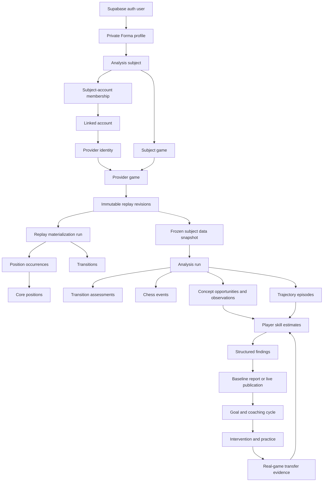
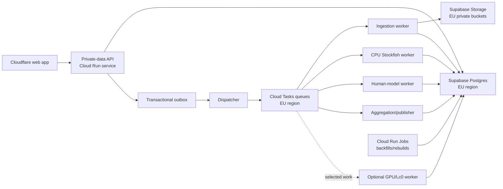

# Forma database architecture plan

Status: canonical v1 data architecture; physical DDL remains an implementation deliverable
Scope: operational database, derived analysis data, coaching data, security,
deletion, rebuilds, and the contracts required by separately deployed backend
services
Not in scope: physical SQL/Drizzle implementation, cloud resource creation, or
cutover execution

## 1. Purpose

Forma is not a game archive with a mistake table attached. It is a versioned
evidence system that must answer four questions:

1. What happened in the player's games?
2. What does that demonstrate about the player's decisions?
3. What should the player work on next?
4. Did that work transfer into later real games?

The database must preserve the evidence needed to answer those questions while
allowing every derived method to improve. A change to a decay function, human
model, phase detector, event detector, or renderer must create a new comparable
result rather than silently rewriting the past.

## 2. Locked product decisions

These decisions are treated as schema inputs.

- Standard chess only. Unsupported variants are rejected before canonical
  persistence. Forma may retain only an aggregate rejection count on the sync
  run; it does not retain the unsupported game ID, replay, moves, or positions.
- Completed games only.
- A Forma user has one personal analysis subject in the initial product.
- A personal subject may contain multiple confirmed provider accounts.
- Account combination is explicit and reversible; it is never inferred from
  similar usernames.
- The same provider identity may be linked independently by multiple Forma
  users. There is no global exclusivity constraint.
- Provider accounts may remain unverified during beta, but verification state
  is recorded and never implied.
- Import all supported completed games. The default examination cohort uses
  rated, human-versus-human standard games. Casual, bot, correspondence, and
  unusual time-control games remain separately filterable.
- Bullet, blitz, rapid, classical, and correspondence evidence is never mixed
  without an explicit versioned cohort/model decision.
- When the final subject/editorial reference to an imported game is deleted,
  its replay and identifiable analysis are deleted. Anonymous position/engine
  cache entries may remain.
- Production data and compute are EU-hosted by default.
- Initial social scope is public player lookup by a unique Forma handle.
  Provider handles are discoverable only by opt-in. Email is never searchable.
- Friendship, blocking, shared training, and co-op learning are future social
  capabilities. Friendship will not implicitly grant access to private
  analysis.
- Baseline reports are immutable. The live dashboard may advance independently.
- Training success is not evidence of real-game improvement. Transfer must be
  observed in a later comparable real-game opportunity.

## 3. Schema constitution

These invariants take precedence over individual table convenience.

### 3.1 Authority

- Provider responses and retained raw artifacts are source evidence.
- An immutable normalized replay revision is Forma's authoritative playable
  representation of a game.
- Positions, occurrences, transitions, features, and opening observations are
  rebuildable structural materializations.
- Engine outputs, semantic events, player estimates, findings, trajectories,
  and reports are immutable derived outputs tied to exact method versions.
- Read models are disposable projections. They are never the only copy of a
  fact.

### 3.2 Immutability and supersession

- Replay revisions are appended, never edited.
- Component/method versions and analysis recipes are appended, never edited.
- Published analysis outputs are appended, never edited.
- A newer result supersedes an older result through a separate publication
  pointer or explicit supersession relationship.
- Mutable lifecycle state, such as `draft -> validated -> production`, is kept
  separately from immutable method content where practical.

### 3.3 Missing information

- `null` means unknown, unavailable, or not applicable according to the column
  contract.
- `false` means a claim was evaluated and is false.
- An empty collection means it was evaluated and contains no members.
- Unknown clocks, ratings, outcomes, and confidence are never replaced with
  zero or a fabricated default.

### 3.4 Evidence and conclusions

- Played moves receive continuous objective and practical measurements.
- Concept evidence is atomic: threat recognition and defensive execution are
  separate observations when they differ.
- `untested` is not a decision outcome. If the relevant response was not
  observed, no success/failure claim is made about that skill.
- A concept-specific graded score is allowed only when it names a versioned
  rubric.
- Findings must link to supporting and contradicting evidence.
- Rendered prose is not evidence and may be regenerated independently.

### 3.5 Ownership and privacy

- Ownership is expressed through subject and source relationships, never
  inferred from a username stored on a game.
- Canonical chess facts do not grant a user permission to view another user's
  analysis.
- A friend relationship does not grant analysis access.
- User deletion removes subject-owned and user-linked data through an explicit
  dependency graph.
- Operational/audit logs do not contain raw PGNs, provider credentials, model
  prompts containing private data, or full analysis payloads.

### 3.6 Reproducibility

Every derived output identifies:

- the immutable input replay revision or subject data snapshot;
- the analysis run that produced it;
- the immutable recipe/component versions used;
- upstream outputs reused by the run;
- the time it was produced;
- whether it is currently published.

### 3.7 Transactions

- No provider, object-storage, engine, or model network call occurs inside a
  database transaction.
- Transactions commit short, already-prepared state changes.
- Every retriable operation has an idempotency key.
- A sync cursor advances only with the canonical records for the corresponding
  provider checkpoint.
- A new analysis becomes visible atomically; partially completed runs are never
  mixed with the currently published run.

## 4. PostgreSQL schema boundaries

Application tables should not be created indiscriminately in Supabase's
Data-API-exposed `public` schema.

| Schema | Responsibility | Browser exposed |
| --- | --- | --- |
| `app` | Profiles, subjects, linked accounts, entitlements | No |
| `social` | Public player directory and future relationships | No; accessed through API |
| `chess` | Provider games, replay revisions, positions, transitions | No |
| `analysis` | Methods, runs, evaluations, evidence, estimates, findings | No |
| `coaching` | Onboarding, reports, goals, practice, transfer | No |
| `ops` | Syncs, work ledger, outbox, deletion workflows | No |
| `api` | Deliberately exposed security-invoker views/functions, if ever needed | Opt-in only |
| `private` | Privileged helper functions and authorization helpers | Never |

The browser continues to use Supabase Auth and calls the Forma API for product
data. It does not query analytical tables directly. Grants and RLS remain
defence in depth even when a schema is not exposed.

## 5. Identifier, type, and naming rules

- Lowercase `snake_case` identifiers only.
- `bigint generated always as identity` for high-volume/internal rows.
- UUIDs for user-facing or independently addressable business objects such as
  subjects, goals, reports, analysis runs, and public game links.
- `timestamptz` for all instants; dates only for genuine calendar dates.
- Milliseconds are stored as `bigint` where provider values can be large.
- Probabilities and statistical estimates use `double precision` plus range
  checks; engine centipawns and mate distances use integers.
- Text plus check constraints is preferred for evolving workflow statuses.
  PostgreSQL enums are reserved for genuinely stable chess primitives.
- JSONB is used for immutable replay documents, versioned configurations, and
  opaque provider/model payloads that are not primary query dimensions.
- Queryable dimensions are relational columns, not hidden in JSONB.
- No JSONB GIN index is created without a named production query requiring it.
- Every foreign-key path used for joins, deletes, or RLS receives an index.
- Every table and every ambiguous nullable column receives a database comment.

## 6. Logical domain map



## 7. Identity, ownership, and public discovery

### 7.1 `app.profiles`

One private application profile per `auth.users` row.

Key columns:

- `user_id uuid primary key references auth.users(id) on delete cascade`
- `email` is not duplicated unless required for product operation; Auth remains
  authoritative for login email
- `locale`, `timezone`
- `created_at`, `updated_at`
- deletion lifecycle fields, if a short recoverable deletion window is adopted

It does not contain a subscription enum or public discovery fields.

### 7.2 `app.analysis_subjects`

Represents whose chess behaviour is being analysed.

Key columns:

- `id uuid primary key`
- `kind`: `personal`, `editorial`, or `case_study`
- `owner_user_id uuid null references app.profiles`
- `display_label`
- `status`: `active`, `archived`, `deleting`
- `created_at`, `archived_at`

Constraints:

- initial product: at most one active `personal` subject per owner;
- editorial subjects have no user owner;
- a case-study subject records its consent/provenance separately;
- no subject is identified globally by a provider username.

### 7.3 `app.providers`

Small reference table rather than a database enum.

Key columns:

- `id smallint primary key`
- `slug unique`: initially `chesscom`, `lichess`
- `display_name`
- capability flags such as stable player ID, clocks, rating history, and OAuth
- `adapter_contract_version`

### 7.4 `app.provider_identities`

One observed identity within a provider namespace.

Key columns:

- `id bigint identity primary key`
- `provider_id`
- `provider_identity_key`: stable provider ID when available, otherwise a
  documented normalized-username key
- `key_basis`: `provider_id` or `username`
- `current_display_username`, `current_normalized_username`
- `first_seen_at`, `last_seen_at`
- `provider_deleted_at`

Constraints:

- unique `(provider_id, provider_identity_key)`;
- username-keyed identity is explicitly lower confidence because providers may
  permit renames or reuse;
- a provider identity may be referenced by many users' linked accounts.

### 7.5 `app.provider_identity_aliases`

Tracks observed provider username history without rewriting old games.

Key columns:

- `provider_identity_id`
- `display_username`, `normalized_username`
- `observed_from`, `observed_to`
- `source_artifact_id` when available

### 7.6 `app.linked_accounts`

A user-owned connection/claim, not the global provider identity.

Key columns:

- `id uuid primary key`
- `owner_user_id`
- `provider_identity_id`
- `connection_kind`: public lookup, OAuth, or another future mechanism
- `verification_status`: unverified, confirmed, verified, failed, or revoked
- `status`: active, paused, disconnected
- `provider_handle_discoverable boolean default false`
- `created_at`, `disconnected_at`

Credentials or refresh tokens are stored in a secret manager or dedicated
encrypted credential store, never in this row as plain text.

Constraints:

- one active link from a user to a given provider identity;
- no uniqueness across different users;
- unlinking the account closes subject membership and initiates scoped deletion
  or retention evaluation.

### 7.7 `app.subject_account_memberships`

Explicitly confirms that a linked account contributes evidence to a subject.

Key columns:

- `subject_id`, `linked_account_id`
- `valid_from`, `valid_to`
- `confirmation_method`, `confirmed_at`, `confirmed_by_user_id`

Constraints:

- the subject owner and linked-account owner must match for a personal subject;
- one linked account has at most one active personal-subject membership for its
  owner;
- historical membership is retained so old snapshots remain explainable.

### 7.8 `social.public_player_profiles`

The only initial player-discovery record.

Key columns:

- `user_id primary key`
- `personal_subject_id unique`
- `handle citext unique`
- `display_name`, `avatar_url`
- `is_discoverable boolean`
- `show_provider_handles boolean default false`
- `created_at`, `updated_at`

Lookup returns only an explicit public projection. Email, linked-account IDs,
private analysis, goals, and ratings are not implicitly exposed.

Future social tables are specified in section 20 but are not part of the first
database migration.

### 7.9 `social.case_study_publications`

One deliberately public editorial projection. It never points at a private live
subject publication implicitly.

Key columns:

- `id uuid primary key`, unique `slug`;
- editorial/case-study `subject_id`;
- exact successful analysis run and immutable report/publication manifest;
- title, summary, public state, published/withdrawn timestamps;
- source, licence, consent, and editorial-review references;
- small-cell/redaction policy component version;
- public content checksum and optional ready artifact reference.

Only reviewed public fields are returned. Withdrawing a case study removes the
public pointer without rewriting the immutable analysis evidence.

## 8. Provider sync and source provenance

### 8.1 `ops.account_sync_states`

One current provider-specific checkpoint per linked account and sync stream.

Key columns:

- `linked_account_id`
- `stream_key`, for example completed-games history
- `cursor_contract_version`
- `cursor_payload jsonb`
- `last_provider_watermark`
- `last_successful_sync_at`
- `consecutive_failure_count`
- `updated_at`

The cursor belongs to the linked account. Two users linking the same provider
identity do not share cursor state.

### 8.2 `ops.sync_runs`

Append-only record of one requested sync/import operation.

Key columns:

- `id uuid primary key`
- `linked_account_id`, `subject_id`
- `trigger`: onboarding, manual, scheduled, backfill
- `status`
- starting and ending cursor hashes
- requested provider range/watermark
- counters: fetched, accepted, duplicate, corrected, unsupported, rejected
- `started_at`, `completed_at`
- structured terminal error code and sanitized detail

### 8.3 `ops.sync_checkpoints`

Represents one provider page/archive/checkpoint that can be committed and
retried independently.

Key columns:

- `sync_run_id`, `sequence_no`
- `idempotency_key unique`
- input and output cursor payload/hash
- `status`
- accepted/rejected counts
- source artifact reference when retained

The account cursor advances only after every canonical game operation belonging
to the checkpoint commits.

### 8.4 `ops.artifacts`

Generic metadata for raw provider inputs, normalized PGNs, large analysis/report
outputs, model/catalogue assets, and temporary exports retained in private
Supabase Storage through the backend `ArtifactStore` contract.

Key columns:

- `id uuid primary key`
- nullable `provider_id`, `artifact_kind`
- storage backend, bucket, and immutable opaque key
- `sha256`, byte size, media type, compression
- lifecycle state: pending, ready, deleting, deleted, failed
- `retention_class`: subject_owned, system_immutable, editorial, temporary
- nullable owning subject plus creator workflow/run/source references
- `created_at`, verified/ready time, `expires_at`, deletion timestamps and
  sanitized deletion failure classification

Artifact content is not duplicated in PostgreSQL. Supabase Storage does not
provide S3 object versioning, so version identity comes from immutable keys,
checksums, and database manifests rather than a mutable object generation.
Object writes happen before
the short database transaction; unreferenced objects are removed by a janitor.
Mixed provider archives/pages containing unsupported variants are either
filtered before retention or not retained. The raw-artifact path must not become
a back door that stores variant games Forma rejected canonically.

Constraints:

- unique `(storage_backend, bucket, object_key)`;
- a ready artifact has byte size and checksum;
- a deleted artifact has no usable download state;
- subject-owned artifacts name an owning subject or an unambiguous typed owner
  that resolves to one;
- system artifacts use checksum-addressed immutable keys.

### 8.5 Canonical ingestion transaction

For each fetched checkpoint:

1. Fetch and validate outside the database transaction.
2. Reject incomplete or non-standard games before canonical persistence.
3. Write any retained raw artifact and calculate hashes outside the transaction.
4. Normalize accepted games and prepare replay documents outside the transaction.
5. In one short transaction per bounded checkpoint:
   - upsert provider identities by stable provider key;
   - upsert provider-game identities;
   - insert a replay revision only when its normalized checksum is new;
   - insert immutable participants for that revision;
   - switch the provider game's current replay pointer when appropriate;
   - upsert the subject-game relationship and its linked-account source;
   - insert durable materialization/analysis work and transactional outbox rows;
   - mark the sync checkpoint committed;
   - advance the linked account cursor.
6. Dispatch outbox messages after commit.

Any failure rolls back the checkpoint, including its cursor advancement. A retry
with the same idempotency key produces the same canonical result.

## 9. Canonical games and replay revisions

### 9.1 `chess.provider_games`

Stable identity for a provider's game, not a user's copy of it.

Key columns:

- `id bigint identity primary key`
- `provider_id`, `provider_game_id`
- `current_replay_revision_id`
- `first_seen_at`, `last_seen_at`
- provider deletion/unavailability state

Constraint: unique `(provider_id, provider_game_id)`.

No automatic cross-provider merge occurs. A normalized replay fingerprint may
identify a review candidate but cannot prove two short games are the same event.

### 9.2 `chess.game_replay_revisions`

Immutable provider-neutral replay plus relational query metadata.

Key columns:

- `id bigint identity primary key`
- `provider_game_id`
- `revision_no`
- `normalizer_component_version_id`
- `source_artifact_id null`
- `normalized_replay jsonb`
- `normalized_sha256`
- `source_sha256 null`
- `initial_fen`
- `played_at`, `completed_at null`
- `rated boolean null`
- normalized speed and time-control fields
- absolute result and normalized termination
- `ply_count`
- provider URL snapshot
- `revision_reason`: first_seen, provider_correction, or renormalized
- `created_at`

Constraints:

- unique `(provider_game_id, revision_no)`;
- unique `(provider_game_id, normalized_sha256)`;
- standard variant only;
- completed result only;
- `ply_count` equals the replay move count, verified at the application boundary
  and in materialization tests.

The JSON replay contains ordered moves with UCI, SAN, clocks when known,
provider annotations, and source-level metadata required for deterministic
replay. It is not queried for product search and receives no general GIN index.

### 9.3 `chess.game_revision_participants`

Two immutable participant snapshots for each replay revision.

Key columns:

- `replay_revision_id`, `color`
- `provider_identity_id null`
- provider username/title snapshot
- rating and rating change when known
- absolute outcome
- bot/provisional flags when known

Constraint: primary key `(replay_revision_id, color)` and exactly one white and
one black row validated at publication.

### 9.4 `chess.subject_games`

The owned statement that a provider game is evidence for an analysis subject.

Key columns:

- `id uuid primary key` used in product URLs
- `subject_id`
- `provider_game_id`
- `latest_replay_revision_id`
- `subject_color`
- `status`: included, excluded, ambiguous, deleted
- exclusion/quality reason when applicable
- `first_included_at`, `updated_at`

Constraint: unique `(subject_id, provider_game_id)`.

If both colours appear to belong to the same personal subject, the game is
marked ambiguous and excluded until resolved. Canonical transitions never store
`actor_is_subject`; that is determined by comparing transition actor colour
with `subject_games.subject_color`.

`latest_replay_revision_id` describes the newest canonical source revision. The
currently visible game-analysis publication independently pins the exact replay
revision it analysed. If a provider correction arrives, Forma may show that
reanalysis is pending but never combines the corrected replay with assessments
from the older revision.

### 9.5 `chess.subject_game_sources`

Records every linked account through which a subject observed the game.

Key columns:

- `subject_game_id`, `linked_account_id`
- `first_seen_at`, `last_seen_at`
- originating sync/checkpoint

Constraint: unique `(subject_game_id, linked_account_id)`.

### 9.6 `chess.provider_rating_observations`

Append-only provider-native rating history.

Key columns:

- `id bigint identity primary key`
- `provider_identity_id`
- provider speed/rating-pool key
- `rating`, deviation/provisional fields when supplied
- `observed_at`
- replay revision or provider-profile artifact source
- confidence/source kind

Provider rating remains provider- and pool-specific. Forma never treats a rapid
rating and a blitz rating as the same scale without a versioned translation.

## 10. Core positions, historical context, and transitions

### 10.1 `chess.core_positions`

A shared legally meaningful board state.

Key columns:

- `id bigint identity primary key`
- `canonicalizer_component_version_id`
- collision-resistant `position_key`
- canonical first-four-field FEN
- board placement
- side to move
- castling rights
- legally available en-passant square or null
- piece count
- optional deterministic pawn/material signatures used for exact filtering
- `created_at`

Constraint: unique `(canonicalizer_component_version_id, position_key)`.

The en-passant component is canonicalized according to legal move availability,
not copied blindly from a provider FEN. The halfmove clock and fullmove number
are not part of this shared core.

### 10.2 `chess.replay_materialization_runs`

One immutable rebuild of structural rows from a replay revision.

Key columns:

- `id uuid primary key`
- `replay_revision_id`
- materializer and canonicalizer component versions
- `status`
- input and output checksums
- counts for occurrences and transitions
- `started_at`, `completed_at`

A separate current-materialization publication selects the active completed run
for a replay revision.

### 10.3 `chess.position_occurrences`

One game-specific position before the first move and after every ply.

Key columns:

- `id bigint identity primary key`
- `materialization_run_id`
- `position_index`: zero before the first ply, then one after each ply
- `core_position_id`
- `halfmove_clock`, `fullmove_number`
- `repetition_occurrence_count`
- `history_signature`: digest of the rule-relevant reversible history
- threefold/fivefold claim or automatic-draw state
- fifty-/seventy-five-move claim or automatic-draw state
- white and black clock milliseconds when reconstructable
- terminal/check state as deterministic structural facts

Constraints:

- unique `(materialization_run_id, position_index)`;
- count equals replay ply count plus one;
- missing clocks remain null;
- history-dependent fields are generated by replaying from the initial state,
  not inferred from isolated FENs.

### 10.4 `chess.game_transitions`

One canonical action per ply.

Key columns:

- `id bigint identity primary key`
- `materialization_run_id`
- `ply` one-based
- `before_occurrence_id`, `after_occurrence_id`
- actor colour
- UCI and SAN
- from square, to square, promotion piece
- deterministic flags: capture, en passant, castle, check, mate, pawn move
- clock after move and think time when known
- provider annotation payload only when required for audit

Constraints:

- unique `(materialization_run_id, ply)`;
- `before.position_index = ply - 1`;
- `after.position_index = ply`;
- actor matches the before-position side to move;
- transitions form one unbroken replay chain.

### 10.5 Evaluation scopes

Every cached evaluation declares one scope:

- `core`: reusable board/castling/legal-en-passant state only;
- `rule50`: core plus halfmove clock;
- `history_exact`: core, halfmove clock, and exact rule-relevant history;
- `occurrence`: explicitly tied to one position occurrence and not shared.

History-exact engine requests reconstruct the move history supplied to the
engine. A core evaluation may be useful for broad comparison, but it cannot be
presented as exact evidence for a repetition- or draw-sensitive occurrence.

## 11. Position retrieval

Forma supports three separate retrieval contracts.

### 11.1 Exact position retrieval

Input: canonical core-position key.
Output: matching occurrences filtered to a subject, cohort, and published
materialization.

This finds exact transpositions while retaining each occurrence's clocks,
history, player, phase, and subsequent decision.

### 11.2 Structural position retrieval

`analysis.position_feature_sets` stores immutable versioned features for a core
position:

- `core_position_id`
- `feature_component_version_id`
- typed search projections such as pawn-structure key, material signature,
  king-zone signature, phase/material bucket, and open-file mask
- an unindexed JSONB payload for additional version-specific features
- checksum and creation time

B-tree indexes are created only for demonstrated retrieval paths. Structural
similarity scores are computed by a named method version and retain their
component scores.

### 11.3 Semantic retrieval

Semantic search begins with concept opportunities, chess events, roles, and
outcomes. Board similarity alone cannot establish that two positions tested the
same idea.

A future `analysis.position_embeddings` table may add:

- `core_position_id`
- embedding-model component version
- vector dimension/model-specific storage
- vector and normalization metadata

It is added only after a labelled retrieval benchmark exists. The foundational
schema does not depend on pgvector or one embedding dimension.

## 12. Method versions, recipes, and input snapshots

### 12.1 `analysis.components`

Stable catalogue of replaceable analytical responsibilities.

Examples:

- provider normalizer;
- replay materializer;
- position canonicalizer;
- Stockfish profile;
- human move-policy model;
- expected-score calibration;
- phase detector;
- position feature extractor;
- event detector;
- concept difficulty model;
- skill estimator/decay model;
- trajectory aligner;
- finding rule set;
- explanation renderer.

Key columns:

- `id uuid primary key`
- stable `component_key unique`
- category, description, input contract, output contract

### 12.2 `analysis.component_versions`

Immutable implementation/configuration of one component.

Key columns:

- `id uuid primary key`
- `component_id`
- semantic version or monotonically increasing version number
- implementation/artifact SHA-256
- immutable configuration JSONB and configuration hash
- model/binary/weights identity when applicable
- licence and provenance metadata
- deterministic flag
- `created_at`

Constraint: unique `(component_id, version)` and unique immutable content hash
where appropriate.

Validation/promotion state is stored in a separate lifecycle table so an
immutable component record does not change when approved.

### 12.3 `analysis.component_version_dependencies`

An explicit directed acyclic graph of component-version dependencies.

Examples:

- a human-policy calibration depends on a Maia model artifact;
- a finding rule set depends on a skill-estimate contract;
- a renderer depends on a finding schema, but findings do not depend on prose.

Cycles are rejected during recipe validation.

### 12.4 `analysis.recipe_versions`

Immutable manifest defining one coherent analysis contract.

Key columns:

- `id uuid primary key`
- `recipe_key`, version
- manifest SHA-256
- input/output schema versions
- intended run type
- `created_at`

### 12.5 `analysis.recipe_components`

Maps every named recipe role to one exact component version.

Constraint: unique `(recipe_version_id, role)`.

### 12.6 `analysis.recipe_promotions`

Append-only operational history selecting a recipe for a surface/environment:

- screening;
- deep game analysis;
- onboarding examination;
- live player profile;
- research/shadow evaluation.

Promotion changes what new runs use. It never changes an existing run or
baseline report.

### 12.7 `analysis.cohort_definition_versions`

Immutable rules describing which subject games form a coherent dataset.

Queryable fields include:

- provider inclusion;
- rated/casual/bot policy;
- speed/time-control buckets;
- played-at window;
- recency and minimum-quality rules;
- missing-clock policy;
- supported rating range;
- minimum evidence/coverage policy.

The full definition and hash are retained. Changing “minimum 50 games” or the
default speed mix creates a new cohort version, not a hidden behaviour change.

### 12.8 `analysis.subject_data_snapshots`

Frozen manifest of the exact games used for subject-level analysis.

Key columns:

- `id uuid primary key`
- `subject_id`
- `cohort_definition_version_id`
- cutoff/watermark
- snapshot hash
- game count and date range
- `created_at`

### 12.9 `analysis.subject_data_snapshot_games`

Key columns:

- `snapshot_id`
- `subject_game_id`
- exact `replay_revision_id`
- exact `materialization_run_id`
- inclusion reason/weight when the cohort contract uses weighting

Constraint: primary key `(snapshot_id, subject_game_id)`.

This manifest makes a baseline reproducible even after a provider correction or
new materialization version.

### 12.10 Validation and promotion evidence

`analysis.validation_datasets` identifies immutable labelled/holdout corpora by
manifest hash, storage reference, cohort/sampling description, account-disjoint
and chronological split rules, licence, and governance classification.

`analysis.validation_runs` records one component/recipe evaluation against a
fixed dataset, including candidate and baseline versions, execution revision,
status, and output checksum.

`analysis.validation_metrics` stores named metrics by declared slice such as
provider, rating band, time control, phase, clock availability, and concept. It
retains sample size, value, uncertainty interval, and calibration artifacts.

`analysis.component_lifecycle_events` and recipe-promotion records reference the
validation evidence used to move a candidate through draft, shadow, validated,
production, or retired states. Data does not continuously retrain or silently
promote production behaviour.

## 13. Analysis execution and atomic publication

### 13.1 `analysis.runs`

One coherent immutable attempt to produce a declared output contract.

Key columns:

- `id uuid primary key`
- `run_type`
- `recipe_version_id`
- optional `subject_id`, `subject_game_id`, `replay_revision_id`, or
  `subject_data_snapshot_id`, constrained according to run type
- `status`: planned, running, succeeded, failed, cancelled
- input manifest hash
- output manifest hash on success
- parent/comparison run when applicable
- trigger and actor
- `started_at`, `completed_at`
- sanitized failure classification

Run types have explicit required outputs. “Succeeded” means the output manifest
has passed integrity checks, not merely that all worker processes exited zero.

### 13.2 `analysis.run_dependencies`

Records exact upstream runs/artifacts reused by a run.

For example, a new skill-estimator run can reuse:

- the same frozen subject snapshot;
- existing transition assessments;
- existing concept observations;
- while replacing only the estimator and finding rules.

### 13.3 `analysis.run_artifacts`

Manifest of concrete output families and counts/checksums.

Examples: transition assessments, events, observations, estimates, trajectory
bins, findings, or report sections.

### 13.4 Publications

Publication tables are type-safe rather than one polymorphic `scope_type/id`
table:

- `analysis.subject_live_publications`
- `analysis.subject_game_publications`
- `chess.replay_materialization_publications`
- baseline reports pin their run directly

Each current publication row has a matching append-only publication-history
table containing old and new run IDs, actor, reason, and timestamp.

Publication transaction:

1. Lock the relevant publication row or advisory key.
2. Verify the candidate run succeeded and contains every required artifact.
3. Verify its subject/snapshot/scope matches the publication target.
4. Insert publication history.
5. Replace the current run pointer.
6. Commit once.

Readers see either the complete old run or the complete new run.

## 14. Durable work ledger for multiple deployments

The database owns workflow truth; a queue transports wake-up messages. Queue
delivery alone is never treated as task completion.

### 14.1 `ops.workflows`

One user- or system-visible operation such as account sync, onboarding
examination, game analysis, model backfill, or subject re-estimation.

Key columns:

- `id uuid primary key`
- workflow type and owner/scope
- requested recipe/version
- status and progress counters
- cancellation request
- cost/budget ceilings
- `created_at`, `started_at`, `completed_at`

### 14.2 `ops.work_items`

Small, independently retriable units of work.

Key columns:

- `id bigint identity primary key`
- `workflow_id`, optional `analysis_run_id`
- `task_type`
- `resource_class`: API-light, ingestion, CPU-engine, CPU-model, GPU-model,
  aggregation, publication
- typed input reference plus small payload JSONB
- `idempotency_key unique`
- priority and `available_at`
- status: blocked, ready, leased, succeeded, retry_wait, dead, cancelled
- attempt/max-attempt counts
- lease owner, lease expiry, heartbeat
- timeout/deadline
- output artifact reference or summary
- sanitized error code/detail
- timestamps

The row names a capability, not a Cloud Run service. Deployments can be split,
merged, or replaced without changing historical task records.

### 14.3 `ops.work_item_dependencies`

Allows a task to become runnable only after required upstream items succeed.
Cycles are prohibited.

### 14.4 `ops.work_attempts`

Append-only attempt telemetry:

- work item and attempt number;
- deployment/service and revision;
- worker instance identity;
- claimed/started/finished times;
- CPU/GPU/model profile;
- input/output counts;
- cache hits;
- billed/estimated compute;
- sanitized terminal result and logs/trace pointer.

### 14.5 `ops.outbox_events`

Transactional outbox for reliable dispatch after canonical commits.

Key columns:

- `id bigint identity primary key`
- aggregate type/id and event type
- idempotency/deduplication key
- small payload
- `available_at`, publish attempts, published timestamp

An external dispatcher may send to Cloud Tasks, Pub/Sub, or another queue. A
Postgres-native queue may also be used. Consumers remain idempotent in all
cases.

### 14.6 Worker claiming

Database-polling workers use a short atomic `FOR UPDATE SKIP LOCKED` claim.
HTTP-push workers claim the named work item conditionally. A lease expiry makes
abandoned work retryable. Completion is a conditional update from the active
lease and must be idempotent.

The API process does not start an unbounded background engine loop. CPU and GPU
work can run in independently scaled deployments without changing this schema.

### 14.7 `ops.idempotency_records`

Durable API command replay contract:

- actor/profile ID, HTTP method, normalized route key, idempotency key;
- normalized request digest;
- response status and safe response/resource/workflow reference;
- state: processing, completed, failed;
- created/completed/expiry timestamps.

Constraint: unique `(actor_profile_id, route_key, idempotency_key)`. Reusing the
key with a different request digest is a conflict. Records contain no bearer
token or raw sensitive request body.

### 14.8 `ops.audit_events`

Append-only content-free security/administrative audit:

- actor kind and opaque actor/service reference;
- action and typed target reference;
- request/trace ID;
- result, reason code, and minimal non-sensitive metadata;
- occurred time.

Audit rows never contain PGN, provider bodies, email, tokens, signed URLs, model
prompts, or analysis payloads. They have an explicit retention policy and cannot
be used to reconstruct deleted user content.

## 15. Engine and model outputs

### 15.1 `analysis.model_profiles`

A searchable projection over component versions for executable engines/models.

Key columns:

- `component_version_id primary key`
- role: objective_engine, human_policy, human_outcome, secondary_oracle,
  detector, embedding
- binary/weights/network hashes
- supported hardware/resource class
- input context contract
- output interpretation contract
- licence-review status

### 15.2 `analysis.position_evaluations`

Immutable objective engine result.

Key columns:

- `id bigint identity primary key`
- `core_position_id`
- evaluation scope
- halfmove clock/history signature/occurrence reference as required by scope
- objective model profile
- search limit type/value, MultiPV, threads, hash, tablebase options
- evaluation from a declared colour perspective
- centipawns or mate distance
- WDL triplet and expected-score calibration version
- nodes, NPS, engine time, wall time
- deterministic cache key and provenance
- `computed_at`

Constraints:

- exactly one of centipawn or mate representation according to output contract;
- WDL members are non-negative and normalized according to the engine contract;
- cache uniqueness covers every compatibility-relevant input, profile, scope,
  and limit;
- no subject/user/game ID is part of a reusable anonymous cache record.

Reusable evaluations do not reference the run that first requested them. Their
engine/profile/input provenance is sufficient. `analysis.run_evaluation_uses`
links a run and its typed input role to an evaluation. Deleting the run removes
the use row without deleting an otherwise anonymous cache entry. Occurrence-
scoped evaluations are not anonymous and follow the occurrence's retention.

### 15.3 `analysis.evaluation_candidates`

One row per MultiPV candidate:

- `position_evaluation_id`, rank
- UCI move
- candidate centipawn/mate/WDL/expected score
- principal variation stored as ordered JSONB because it is replayed, not
  searched as arbitrary JSON
- nodes/visits when supplied

Constraint: primary key `(position_evaluation_id, rank)` and unique move within
an evaluation.

### 15.4 `analysis.model_inferences`

Immutable non-Stockfish inference such as human-policy, human-outcome, Lc0, or
specialized detector output.

Key columns:

- `id bigint identity primary key`
- model profile
- core position and optional exact occurrence
- declared input context: actor/opponent provider ratings, speed/time-control
  bucket, move history availability, clock bucket when supported
- input contract hash and cache key
- output kind
- calibrated scalar outputs and unindexed raw payload
- calibration component version
- `computed_at`

Maia human-game WDL is stored under a human-outcome output kind and is never
placed in Stockfish objective-WDL columns.

`analysis.run_model_inference_uses` links runs to reusable inferences. An
inference is eligible for anonymous retention only when it has no occurrence,
game, subject, account, or user reference and its context cannot identify a
person. Other inferences follow their source occurrence/subject retention.

### 15.5 `analysis.model_move_probabilities`

One row per retained policy move:

- inference ID, rank, UCI move
- probability/logit/visit count according to model contract

Probability mass retained outside top-k is explicit so entropy and adequate-set
probability are not overstated.

### 15.6 `analysis.model_agreement_assessments`

Versioned comparison between objective/secondary oracles:

- participating outputs;
- value/candidate disagreement;
- uncertainty/review-priority result;
- comparison method version.

Disagreement raises uncertainty or review priority. It never silently allows a
secondary model to overwrite the objective oracle.

## 16. Transition and player-perspective assessments

### 16.1 `analysis.transition_assessments`

Objective assessment of every transition, independent of any Forma subject.

Key columns:

- `id bigint identity primary key`
- producing run and `transition_id`
- before-position evaluation
- after-position/played-move evaluation
- actor-perspective expected score before and after
- actor decision loss
- played-move rank
- best move
- acceptable-move tolerance/rule version
- acceptable-move count
- played move acceptable boolean
- only-move classification
- criticality and objective difficulty features
- phase/progress classification and confidence

Constraint: unique `(analysis_run_id, transition_id)`.

“Good”, “mistake”, and “blunder” are optional versioned presentation
classifications derived from measurements, not foundational facts.

### 16.2 `analysis.subject_transition_assessments`

Places every transition into one subject's trajectory and human context.

Key columns:

- `id bigint identity primary key`
- producing run
- `subject_game_id`
- `transition_assessment_id`
- subject role: actor or opponent
- subject-perspective expected score before/after and delta
- delta interpretation: self-inflicted loss, opponent concession, neutral
- current-level and fixed target-level expectation references
- human findability at current and target level
- practical-pressure components
- clock/time-pressure context
- direct-skill-evidence boolean

Only subject-actor rows may become direct observations of the subject's skill.
Opponent rows supply threats, concessions, tests, and trajectory context.

### 16.3 Practical counterplay contract

For a position and tolerance rule:

1. The objective engine defines the adequate reply set.
2. A rating-conditioned human-policy inference assigns probability to replies.
3. `adequate_reply_probability` is the retained probability mass of adequate
   replies plus an explicit treatment of unretained mass.
4. `practical_pressure = 1 - adequate_reply_probability` under a named method.

Store the vector, not only a composite label:

- objective cost of the move;
- adequate reply count;
- adequate reply probability;
- policy entropy/concentration;
- human outcome estimate;
- actual opponent concession;
- whether the subject capitalized.

This distinguishes sound pressure, solid play, traps/gambles, and ordinary
errors without confusing practical difficulty with objective truth.

## 17. Events, concepts, and atomic skill observations

### 17.1 `analysis.concepts`

Stable concept identity and hierarchy.

Key columns:

- `id uuid primary key`
- stable slug
- family and optional parent concept
- broad category: tactical, positional, strategic, defensive, temporal,
  conversion, or game-management

Concepts include more than named tactics: prevention, quiet moves, move order,
plan recognition, tempo, stabilization, resourcefulness, and conversion are
first-class.

### 17.2 `analysis.concept_versions`

Immutable definition of what counts as an opportunity/evidence for a concept.

Key columns:

- concept ID and version
- human definition
- detector/input contract
- supported roles
- scoring/rubric contract when graded evidence is possible
- version hash

### 17.3 `analysis.chess_events`

A physical or multi-ply occurrence in a game.

Key columns:

- `id bigint identity primary key`
- producing run
- replay/materialization and optional subject-game scope
- event type
- start, focal, and end transitions
- actor/affected colour when applicable
- deterministic/observed facts payload
- detection confidence
- completeness: complete, incomplete, or censored

Examples: threat sequence, defensive sequence, tactical execution, structural
transformation, setback, second chance, or conversion attempt.

### 17.4 `analysis.event_concepts`

Many-to-many semantic labelling of events.

Key columns:

- event ID
- concept-version ID
- colour/actor
- role: create, recognize, execute, avoid, prevent, respond, convert
- label confidence and detector version

No universal partial-success field exists here.

### 17.5 `analysis.concept_opportunities`

The statistical observation unit: a specific chance for the subject to
demonstrate a concept/role.

Key columns:

- `id bigint identity primary key`
- producing run
- subject, subject game, event/concept/role
- opportunity transition and optional response transition
- `response_observed boolean`
- censored reason when no response was observed
- `success boolean null`
- optional numeric score plus mandatory rubric component version
- pre-outcome difficulty vector/reference
- context: phase, speed, clocks, ratings, material/state buckets
- confidence and evidence source kind
- occurred/played time

Constraints:

- if `response_observed = false`, success and score are null;
- if `response_observed = true`, success is non-null;
- a numeric score requires a named rubric;
- difficulty is produced without using the observed success/failure;
- no skill estimate treats an unobserved response as failure.

### 17.6 `analysis.event_relations`

Versioned connections between events, including across games.

Key columns:

- from/to event
- relation type: responds_to, prevents, exact_repeat, structural_repeat,
  improved_response, repeated_failure, transfer_variant
- producing run and relation-method version
- similarity/evidence component scores
- confidence

Relations are directional where meaning requires it. An “improved response”
connection must link the earlier evidence, later evidence, comparison context,
and method that judged comparability.

### 17.7 `analysis.evidence_items`

Uniform registry allowing findings to reference heterogeneous evidence with real
foreign keys.

Key columns:

- `id bigint identity primary key`
- producing run
- evidence kind
- optional subject, subject game, occurred-at time
- confidence

Specialized evidence tables use `evidence_item_id` as a primary key and foreign
key to this registry. The registry therefore supplies a real common reference
without a polymorphic ID column. It does not replace typed evidence columns or
become a generic JSON fact store.

## 18. Trajectory episodes and player-level graph

### 18.1 `analysis.trajectory_episodes`

Versioned multi-transition interpretations such as:

- setback;
- collapse;
- opponent concession;
- stabilization;
- second chance;
- capitalization;
- recovery;
- renewed decline;
- conversion.

Key columns:

- evidence item and producing run
- subject game
- episode kind
- start/focal/end transitions
- expected-score start, trough/peak, end
- magnitude, duration in plies, recovery rate
- counterparty contribution and confidence
- completeness/censoring

Opponent concession is never relabelled as player recovery unless the player
subsequently capitalizes or improves the trajectory through their own moves.

### 18.2 `analysis.player_trajectory_snapshots`

Immutable subject/cohort trajectory aggregate.

Key columns:

- `id uuid primary key`
- producing run, subject data snapshot
- phase-detector and alignment component versions
- expected-score calibration version
- included-game count and coverage metadata
- created time

### 18.3 `analysis.player_trajectory_bins`

One row per reached phase/bin:

- trajectory snapshot
- phase
- bin ordinal and normalized progress bounds
- number of games contributing
- median expected score
- 25th/75th percentile variability
- bootstrap confidence interval when calculated
- phase reach rate
- optional derivative/recovery summaries under a named method

V1 alignment contract:

- detect boundaries per game;
- normalize each reached phase independently to 0–100%;
- resample to approximately twenty bins per phase under the aligner version;
- weight games equally;
- do not impute unplayed endgames;
- do not use unconstrained dynamic time warping for the canonical graph.

## 19. Player estimates, findings, and explanations

### 19.1 `analysis.skill_dimensions`

Defines a measurable skill slice without creating ad-hoc columns.

Key dimensions can include:

- concept version;
- role;
- speed/time-control cohort;
- phase/context bucket;
- current-level, target-level, or objective comparison frame.

Dimensions are versioned and constrained to avoid uncontrolled Cartesian
explosion.

### 19.2 `analysis.player_skill_estimates`

Immutable estimate generated from concept opportunities.

Key columns:

- producing run and subject data snapshot
- subject and skill dimension
- estimator component version
- estimate window/kind: lifetime, baseline, or recent form
- location/mean estimate and uncertainty interval
- raw sample count and effective sample size
- success/failure/graded/censored coverage counts
- evidence date range
- trend/delta from a named comparison estimate
- probability improvement exceeds a meaningful threshold
- calibration/coverage status

V1 may use a transparent discounted Beta evidence model. A later hierarchical
dynamic IRT/state-space estimator creates new rows and findings from the same
underlying observations.

### 19.3 Current, target, and objective standards

For each relevant decision, Forma keeps separate:

- objective chess quality;
- expectation for the player's current provider/rating/time-control cohort;
- expectation for the fixed target cohort of the active coaching cycle.

Target cohort references are frozen within a coaching cycle. A model promotion
does not silently move the player's goalposts; it requires a new cycle or an
explicitly communicated rebasing operation.

### 19.4 Rating-pool calibration and Forma skill scales

Provider ratings remain observations, not universal ability units.

`analysis.rating_pool_calibration_versions` stores immutable mappings between a
provider, rating pool/time control, date range, and a calibrated latent or
percentile scale. It records the dataset, population filters, model version,
uncertainty, and supported range.

`analysis.subject_rating_scale_estimates` stores versioned subject/time-control
estimates and uncertainty produced from provider ratings plus demonstrated
decision evidence. These may support explanations of rapid/blitz differences
and goal readiness. They are described as demonstrated chess decision ability,
never intelligence.

Cross-pool comparisons are suppressed outside validated ranges rather than
extrapolated confidently.

### 19.5 `analysis.findings`

Structured player conclusion, not prose.

Key columns:

- `id uuid primary key`
- producing run, subject, optional estimate
- finding type: strength, foundational miss, development frontier, repeated
  pattern, inconsistency, early improvement signal, established improvement,
  transfer, or insufficient evidence
- concept/role/context references
- priority and confidence tier
- structured claim values
- hypothesis/claim family and multiple-comparison correction version
- adjusted evidence probability/confidence where the method uses one
- valid evidence window
- supersedes/superseded-by relationship
- `created_at`

### 19.6 `analysis.finding_evidence`

Key columns:

- finding ID, evidence item ID
- role: supports, contradicts, example, or context
- contribution/weight under the finding rule
- display rank

Every user-visible factual finding must have evidence. Contradictory examples
are retained rather than deleted to make a cleaner story.

### 19.7 `analysis.rendered_explanations`

Separate presentation artifact:

- finding/report item reference
- renderer/template/LLM component version
- locale and reading level/tone configuration
- structured-input hash
- rendered text and safety/quality state
- `created_at`

Changing prose does not change the finding. The renderer cannot create engine
scores, concept observations, confidence, or improvement claims absent from its
structured input.

## 20. Public discovery and future social model

### 20.1 Initial player lookup

Player lookup queries only `social.public_player_profiles` and an explicit
provider-handle projection when the owner opted in.

Initial search contract:

- exact and prefix search on normalized Forma handle;
- bounded result count and keyset cursor;
- no email search;
- no implicit fuzzy search across provider identities;
- undiscoverable profiles are omitted;
- editorial profiles carry a visible editorial badge/type;
- lookup returns no private rating history, findings, games, goals, or account
  identifiers.

### 20.2 Future relationship tables

These are designed now but intentionally deferred from the first migration:

- `social.friend_requests`: sender, recipient, status, timestamps;
- `social.friendships`: canonical unordered user pair and accepted time;
- `social.blocks`: blocker, blocked user, timestamp;
- `social.co_learning_spaces`: owner, purpose, lifecycle;
- `social.co_learning_memberships`: space, user, role;
- `coaching.shared_assignments`: space, assignment, sharing scope.

Rules:

- block takes precedence over discovery, request, friendship, and sharing;
- friendship and subject access remain different relationships;
- any future private-analysis sharing uses explicit, revocable grants scoped to
  named artifacts/capabilities;
- no social table is required merely to render the initial Friends/Find Players
  tab.

## 21. Onboarding, coverage, and baseline examination

### 21.1 `coaching.onboarding_runs`

One resumable onboarding journey for a personal subject.

Key columns:

- `id uuid primary key`
- user and subject
- status and current stage
- linked sync workflow
- examination analysis run
- diagnostic session when used
- activation timestamps
- `created_at`, `completed_at`

Activation is recorded only after the user viewed the baseline report, selected
a goal, and accepted a plan/commitment.

### 21.2 `coaching.data_coverage_snapshots`

Immutable coverage decision for one subject data snapshot and policy version.

Key columns:

- `id uuid primary key`
- subject data snapshot
- coverage-policy component version
- overall state: insufficient, limited, sufficient
- total/eligible games and decisions
- recency/date span
- rating/time-control coverage
- clock availability
- phase reach counts
- confidence limitations
- `created_at`

### 21.3 `coaching.data_coverage_dimensions`

One row per measured slice, such as rapid middlegames, endgame conversions, or
fork-defense opportunities:

- coverage snapshot
- dimension key/reference
- observation count and effective count
- date range
- state and limitation reason

“Fifty games” is therefore a versioned onboarding-policy hypothesis, not a
database constraint or a promise that every skill has enough evidence.

The initial calibration target is approximately 1000–2200 provider rating. If a
subject is outside a validated model range, Forma may still show objective game
facts but suppresses unsupported cohort comparisons and personalized claims. It
does not turn every decision into a failure.

### 21.4 `coaching.diagnostic_sessions`

Optional adaptive examination used to reduce uncertainty, not a generic puzzle
set.

Key columns:

- `id uuid primary key`
- onboarding run and subject
- item-selection component version
- status and started/completed times
- pre-explanation guarantee flag

### 21.5 `coaching.diagnostic_session_items`

Ordered assignments with a declared purpose:

- earlier mishandled position;
- transfer variant;
- suspected strength confirmation;
- target-level item;
- timed decision.

The row pins an immutable training-item version and records the uncertainty or
finding it was selected to investigate.

### 21.6 `coaching.diagnostic_attempts`

Append-only user response:

- session item
- chosen move/answer and response sequence
- response time and clock mode
- hints/reveals used
- submitted time
- assessment/evidence item and rubric version

Diagnostic attempts are distinct from later practice attempts.

### 21.7 `coaching.baseline_reports`

Immutable examination result.

Key columns:

- `id uuid primary key`
- subject and onboarding run
- subject data snapshot
- successful analysis run
- coverage snapshot
- report-layout/selection component version
- published time
- immutable report manifest hash

A baseline report never follows the live publication pointer after creation.

### 21.8 `coaching.baseline_report_items`

Ordered structured report contents:

- section and display order;
- finding, estimate, trajectory, or coverage reference;
- visibility/entitlement key;
- rendered explanation reference when applicable.

The free report remains truthful. Entitlements may control depth and continuity,
not hide uncertainty or reverse a conclusion.

## 22. Goals and coaching cycles

### 22.1 `coaching.goal_templates` and `goal_template_versions`

Stable goal identity plus immutable definitions of:

- supported outcome;
- eligible subjects/cohorts;
- required metric types;
- target-setting rules;
- plan-generation inputs;
- success/readiness contract.

Examples include target rating within one provider pool, tactical reliability,
endgame conversion, resilience after setbacks, and blitz decision speed.

### 22.2 `coaching.goals`

User-owned intended outcome.

Key columns:

- `id uuid primary key`
- subject and template version
- status: draft, active, achieved, abandoned, superseded
- user-stated objective and normalized target fields
- target provider/rating pool/time control when relevant
- desired completion horizon
- `created_at`, `activated_at`, `closed_at`

The initial product permits one active primary goal per personal subject.

### 22.3 `coaching.coaching_cycles`

One fixed-baseline attempt to progress toward a goal.

Key columns:

- `id uuid primary key`
- goal and sequence number
- baseline report, analysis run, data snapshot, and estimate references
- fixed target cohort/model references
- start/end dates and status
- plan-generation component version
- `created_at`, `completed_at`

Changing target standard, baseline, or foundational estimator creates a new
cycle or explicit rebasing record.

### 22.4 `coaching.goal_metric_targets`

One measurable target per cycle:

- metric-definition version;
- baseline value/uncertainty;
- target value and direction;
- meaningful-change threshold;
- priority/weight;
- required evidence/coverage rule.

### 22.5 `coaching.goal_requirements`

Versioned prescribed activities such as eligible games per week, reviewed
analyses, or targeted practice. Each requirement stores:

- quantity/window;
- rationale and generator version;
- whether it is essential or recommended;
- relevant cohort/content filter.

There is no universal “four games per day” rule.

### 22.6 `coaching.goal_commitments`

Append-only acceptance/change history for what the user agreed to do:

- cycle;
- commitment level or explicit weekly capacity;
- accepted requirements;
- effective dates;
- user-confirmed timestamp.

### 22.7 `coaching.goal_progress_snapshots`

Immutable periodic result:

- coaching cycle and producing analysis run;
- current estimate and uncertainty;
- progress from frozen baseline;
- readiness relative to frozen target;
- adherence/requirement counts;
- coverage/claim status;
- snapshot time.

Progress and readiness are stored separately.

## 23. Interventions, practice, and transfer

### 23.1 `coaching.training_items`

Stable identity of a reusable exercise/content object.

Key columns:

- `id uuid primary key`
- source kind: player evidence, transformed transfer item, editorial, licensed
  dataset
- source/provenance and retention classification
- owning subject null for shared/editorial content
- created time

### 23.2 `coaching.training_item_versions`

Immutable content:

- initial core/context position or prompt state;
- question/prompt contract;
- legal answer/solution lines;
- concept and difficulty references;
- generation/curation method;
- licence/provenance;
- content checksum.

Player-derived private items are not silently converted into public content.

### 23.3 `coaching.interventions`

Append-only record of what Forma delivered to address evidence:

- subject and coaching cycle;
- finding/evidence addressed;
- intervention type: explanation, lesson, drill, review, recommendation;
- exact content/item version;
- delivery time and channel;
- completion/engagement state.

### 23.4 `coaching.learning_assignments`

Why and when a specific item was assigned:

- subject, coaching cycle, training-item version;
- generating finding/intervention;
- priority, status, assigned/due/completed times;
- assignment-selection component version.

### 23.5 `coaching.practice_attempts`

Append-only attempts:

- assignment/item version;
- submitted move/answer/sequence;
- response time, hints, retries, reveal state;
- success and optional score under an explicit rubric;
- assessment/evidence item;
- attempted time.

Past attempts are never rewritten when a review schedule changes.

### 23.6 `coaching.review_schedules`

Mutable current scheduling state per subject/item or assignment:

- scheduler component version;
- due time;
- interval/stability/difficulty state according to that version;
- last processed attempt;
- updated time.

Scheduler history can be reconstructed from attempts and versioned state-change
events when required.

### 23.7 `coaching.transfer_matches`

Links a later real-game opportunity to earlier intervention/practice:

- earlier finding/intervention/assignment;
- later concept opportunity evidence;
- match-relation method version;
- exact/structural/semantic similarity components;
- comparable-context decision;
- transfer outcome: positive, negative, or inconclusive;
- confidence and created time.

A practice solve may support learning engagement but cannot by itself create an
improvement finding. Improvement claims require comparable real-game evidence.

## 24. Entitlements and usage

### 24.1 `app.feature_catalogue`

Stable feature keys and metering units. Product code does not branch on a
`free/pro` database enum.

### 24.2 `app.entitlement_grants`

Effective-dated grants:

- user/subject;
- feature key;
- source: subscription, trial, promotion, editorial, admin;
- quantitative limit/configuration;
- valid from/to;
- source reference and created time.

### 24.3 `app.subscription_records`

Provider-independent projection of billing state with external billing IDs,
status, period boundaries, and webhook/event provenance. Billing provider
payloads are retained separately and idempotently.

### 24.4 `app.usage_ledger`

Append-only metered usage:

- user/subject and feature;
- quantity/unit;
- idempotency key;
- producing workflow/work item;
- occurred time and billing window.

Counters shown in the product are projections over the ledger, not mutable
facts with no audit trail.

### 24.5 `app.billing_events`

Idempotent external billing-event receipt and processing history:

- billing provider and external event ID;
- event type, created/received timestamps, payload checksum;
- encrypted/private payload artifact reference only when retention is required;
- processing state, attempt count, processed time, sanitized error;
- resulting subscription/entitlement reconciliation reference.

Constraint: unique `(billing_provider, external_event_id)`. Out-of-order events
are resolved from provider object/version timestamps and reconciliation rather
than arrival order.

## 25. Security and RLS contract

### 25.1 Database roles

Use least-privilege runtime roles rather than the `postgres` owner role:

- migration/owner role used only in controlled deployment;
- API read/write role;
- ingestion role;
- analysis worker role;
- publisher/aggregator role;
- read-only operations role.

Each deployment receives only the schemas/actions it needs. The browser never
receives a service-role or database credential.

### 25.2 Data API

- Revoke default `PUBLIC`, `anon`, and `authenticated` privileges from internal
  schemas/tables/functions.
- Do not expose internal schemas through PostgREST.
- If `api` views/functions are introduced, expose them explicitly, enable RLS
  on backing user-owned data, and use `security_invoker` views.
- Security-definer helpers live only in `private`, set an empty `search_path`,
  verify the caller explicitly, and have execute revoked from unintended roles.

### 25.3 Ownership policies

RLS policies and API queries follow subject ownership/access relationships, not
provider usernames. Columns used by RLS are indexed. Update policies use both
`USING` and `WITH CHECK`.

For direct API-to-Postgres traffic, the API starts a short transaction and sets
the verified Supabase user ID as transaction-local database context. RLS reads
that context; it is not a reusable session setting, which is important under a
transaction pooler. Background workers use separate roles and work-item-scoped
grants. The API role and worker roles do not own tables and do not receive
unrestricted `BYPASSRLS` merely for convenience.

Initial access:

- personal subject: owner only;
- editorial public projection: explicitly public fields only;
- case study: explicit consent/publication projection;
- player lookup: public profile projection only.

### 25.4 Credentials and secrets

- Provider OAuth tokens, database passwords, model credentials, Stripe secrets,
  and signing keys live in secret management.
- Credential rows, if needed for rotation metadata, store only encrypted
  ciphertext/key references and never appear in analysis schemas.
- Logs and task errors redact authorization headers, PGNs, usernames where not
  operationally necessary, and model payloads containing private positions.

### 25.5 Security verification

Before launch:

- enumerate exposed schemas and object grants;
- enumerate tables with/without RLS and every policy;
- test owner, non-owner, anonymous, service, and revoked-session paths;
- test views/functions for bypass behaviour;
- run Supabase database/security advisors;
- test deletion while old JWTs still exist and revoke/sign out sessions as part
  of strict account deletion.

## 26. Deletion and retention graph

### 26.1 Data classes

Every table is classified in the schema catalogue as:

- user owned;
- subject owned;
- linked-account owned;
- shared canonical with reference-based retention;
- anonymous reusable computation;
- editorial;
- operational temporary;
- legal/billing retention.

### 26.2 Account deletion workflow

1. Revoke/sign out active sessions and mark the user deleting.
2. Stop new syncs/work and cancel or quarantine active work items.
3. Remove public discovery immediately.
4. Delete personal subject publications, reports, goals, coaching, practice,
   estimates, findings, observations, and subject-game relationships.
5. Delete linked accounts, sync cursors, and credential material.
6. Delete raw source artifacts owned only by the deleted user/subject.
7. For every provider game losing a reference, retain it only if another active
   subject/editorial source remains; otherwise delete replay revisions,
   participants, materializations, game-scoped derived data, and artifacts.
8. Delete or anonymize operational rows according to their retention class.
9. Retain only engine/model cache records whose keys and payloads contain no
   user, subject, account, provider-game, or occurrence reference.
10. Record a minimal non-identifying deletion completion/audit record where
    legally necessary.

Object-storage deletion is durable work with retries. Completion is not reported
until database and object deletions have both succeeded.

### 26.3 Provider unlink versus user deletion

Unlinking one account closes its subject membership and game-source
relationships. A subject game remains only if another active membership/source
still justifies it. Historical baseline snapshots may retain a game only while
the user retains the subject and has chosen to preserve that history; this must
be explicit in the unlink flow.

### 26.4 Editorial and research separation

- Editorial subjects have declared source, date, model version, and publication
  status.
- Ordinary-player case studies require consent records and revocation handling.
- Offline research corpora are stored outside the operational database with
  separate governance.
- Research rows are never made user-visible merely because they contain the
  same provider identity.

### 26.5 `ops.data_export_requests`

User-visible asynchronous export resource:

- `id uuid primary key`, requesting profile/subject;
- export contract/version and frozen cutoff/snapshot references;
- workflow and ready export artifact references;
- status: queued, running, ready, failed, expired, deleted;
- manifest checksum, byte size, expiry, download count/last download time;
- requested/ready/expired/deleted timestamps and sanitized error.

The ready artifact lives in the private temporary export bucket and is returned
only through a short-lived authorized signed URL. Expiry deletes the object and
invalidates download state.

### 26.6 `ops.deletion_requests` and `ops.deletion_items`

`ops.deletion_requests` is the user-visible deletion state and content-free
completion receipt:

- profile/subject, request/workflow, status and current stage;
- request, freeze, completion, and policy-deadline timestamps;
- dependency-manifest version/hash;
- non-identifying completion receipt and sanitized blocking error.

`ops.deletion_items` is the durable typed manifest of database aggregate,
artifact, Auth identity, credential, and operational cleanup work:

- deletion request, item kind, opaque target reference;
- dependency order, state, attempts, next attempt;
- confirmation checksum/status and sanitized error.

The item target is never exposed publicly and contains no artifact signed URL or
deleted content. A request cannot complete while a required item is unconfirmed.

## 27. Read models and cache policy

Canonical normalization should not force the home page to execute dozens of
joins over evidence tables.

Versioned disposable read models include:

- `analysis.subject_dashboard_snapshots`
- `analysis.subject_current_concept_summaries`
- `analysis.subject_current_findings`
- `analysis.subject_game_review_summaries`
- `coaching.current_goal_summaries`
- `coaching.due_learning_queue`
- `coaching.onboarding_progress`

Each projection stores:

- source publication/run ID;
- projection component version;
- generated time;
- completeness/checksum;
- only the fields needed for its named read contract.

They are published atomically after their source run. Deleting a projection must
not destroy unique evidence. Process-local or Redis response caches key entries
by publication/run ID so a publication switch naturally invalidates old data.

## 28. Query catalogue and initial indexes

Indexes are justified by named read/write paths. Exact definitions are verified
with representative `EXPLAIN (ANALYZE, BUFFERS)` plans before production.

### Q1: list a user's linked accounts and sync state

Path: profile -> linked account -> provider identity -> sync state.
Indexes:

- active `linked_accounts(owner_user_id, created_at, id)`;
- unique active `(owner_user_id, provider_identity_id)`;
- `account_sync_states(linked_account_id, stream_key)` primary/unique key.

### Q2: list a subject's games newest first

Filters: subject, inclusion state, speed/provider/result/date.
Uses keyset pagination `(played_at desc, subject_game_id desc)`, never deep
offset. A subject-game index/read projection carries current query metadata if
the join to replay revisions becomes material.

Initial indexes:

- `subject_games(subject_id, status, id)`;
- `subject_games(subject_id, latest_replay_revision_id)`;
- replay revision `(played_at desc, id desc)`;
- selective composite/partial indexes added only for actual common filters.

### Q3: load one game review

Path: owned subject game -> pinned published game-analysis run -> replay ->
positions/transitions -> transition assessments/events.
Indexes:

- unique subject-game public ID;
- transition `(materialization_run_id, ply)`;
- occurrence `(materialization_run_id, position_index)`;
- assessments `(analysis_run_id, transition_id)`;
- events `(analysis_run_id, subject_game_id, focal_transition_id)`.

### Q4: find exact prior occurrences of a position

Path: core-position key -> occurrences -> published materialization -> replay ->
subject game.
Indexes:

- unique core-position version/key;
- `position_occurrences(core_position_id, materialization_run_id, position_index)`;
- snapshot/subject-game replay and materialization references.

### Q5: retrieve structurally similar positions

Path: typed feature filters -> candidate core positions -> scoring -> subject
occurrences.
Indexes begin with pawn-structure/material/phase keys used by the validated
retriever. An embedding index is not created until the embedding benchmark and
dimension are fixed.

### Q6: inspect a player's history for a concept/role

Filters: subject, concept version, role, date, speed, phase, observed result.
Indexes:

- `concept_opportunities(subject_id, concept_version_id, role, occurred_at desc, id desc)`;
- partial observed-response index for estimator reads;
- event-concept reverse index `(concept_version_id, event_id)`.

### Q7: load the home dashboard

Path: subject -> current live publication -> one dashboard snapshot -> current
goal summary/findings/trajectory bins.
Target: bounded query count independent of number of games. Index current
publication by subject primary key and every child projection by snapshot ID and
display order.

### Q8: load an immutable baseline report

Path: owned report ID -> report manifest -> ordered report items -> pinned
findings/estimates/trajectory.
Index `(baseline_report_id, section, display_order)`.

### Q9: load due practice

Filters: subject, due time, status, priority.
Use a partial index on active/due schedules and keyset ordering by
`(due_at, priority, id)`.

### Q10: claim work

Partial composite index over queued work:

```text
(resource_class, priority desc, available_at, id)
where status = 'queued'
```

Lease-recovery index over `(status, lease_expires_at)` for leased rows.

### Q11: player lookup

- unique case-insensitive Forma handle;
- prefix-capable normalized-handle index;
- partial index where `is_discoverable = true`;
- no email index for discovery;
- optional provider-handle projection only where opted in.

### Q12: rating history and time-control comparison

Index `(provider_identity_id, rating_pool_key, observed_at desc, id desc)`.

### Index review rules

- Foreign keys are indexed unless an existing composite index covers the
  leftmost access path.
- Avoid duplicate prefix indexes.
- Partial indexes match the exact query predicate.
- Covering indexes are considered only after measuring heap access.
- Index usage, write amplification, bloat, and unused indexes are reviewed
  periodically with PostgreSQL statistics.

## 29. Scale and storage plan

### 29.1 Expected row growth

Illustrative order of magnitude for one subject with 1,000 games averaging 80
plies:

| Family | Approximate rows |
| --- | ---: |
| Subject games | 1,000 |
| Position occurrences | 81,000 |
| Transitions | 80,000 |
| Transition assessments per published recipe | 80,000 |
| Concept opportunities | Detector-dependent, expected below transitions |
| Player estimates/findings | Hundreds to low thousands |

At 10,000 similarly active subjects, transition-scale tables approach hundreds
of millions of rows. The schema therefore uses compact internal IDs, batched
writes, bounded projections, and explicit version retention.

### 29.2 What remains in operational PostgreSQL

- serving source and canonical records;
- current and retained published analytical evidence;
- coaching/product state;
- durable workflow state;
- indexes required by interactive product queries.

The complete Lichess research corpus, large training tensors, raw model
activations, and unlimited experimental outputs do not belong in the operational
database. They live in controlled object/analytical storage and publish only
validated artifacts/results back to PostgreSQL.

### 29.3 Version-retention policy

Retain indefinitely:

- authoritative replay revisions still referenced by a subject/report;
- baseline-pinned runs;
- production publication history needed to explain user-visible changes;
- evidence required by active findings/goals.

Retain under an explicit policy:

- superseded live runs not pinned by reports/goals;
- shadow/experimental outputs;
- task attempt telemetry;
- source artifacts.

Deletion/archival is dependency-aware. A component-version record may remain
after its bulky artifact/output is archived, preserving provenance.

### 29.4 Partitioning trigger

Do not partition initially. Begin a partition design benchmark when a candidate
table approaches roughly 100 million rows, vacuum/index maintenance becomes a
measured problem, or retention requires efficient range removal.

The partition key is chosen from real query and deletion patterns. PostgreSQL
requires primary/unique constraints on a partitioned table to include the
partition key, so partitioning is not introduced as a speculative cleanup.

### 29.5 Batch and connection discipline

- Insert replay occurrences/transitions and backfills in batches; use `COPY` for
  large offline migrations.
- Keep canonical transactions short.
- Cloud Run runtimes use the appropriate Supabase pooler and a bounded
  application pool.
- Transaction-pooler clients disable prepared statements.
- Each deployment has a connection budget; aggregate possible Cloud Run
  instances cannot exceed the database budget.
- Long analysis never holds a database transaction or connection while the
  engine/model computes.

### 29.6 Monitoring thresholds

Track at minimum:

- table/index size and growth;
- cache hit rates;
- query p50/p95/p99 and rows scanned;
- database connections by role/deployment;
- dead tuples, autovacuum lag, bloat;
- work queue age, lease expiry, retries, dead letters;
- sync/provider error rates;
- analysis cost and duration by recipe/component;
- publication latency;
- deletion completion latency.

Use `pg_stat_statements`, regular `EXPLAIN ANALYZE` against production-shaped
fixtures, and Supabase advisors.

## 30. Backend and deployment boundaries

The database contracts support the following independently deployable units.



### 30.1 API service

- verifies Supabase JWTs;
- resolves user -> owned subject/access;
- serves bounded read models and commands;
- creates workflows/work items/outbox records;
- performs no long-running engine work;
- remains stateless across instances.

### 30.2 Dispatcher

- drains committed outbox records;
- routes by task/resource class;
- emits one queue message containing only work-item identity and authentication
  context needed by the private worker endpoint;
- retries dispatch idempotently.

### 30.3 Routine workers

- Ingestion handles provider I/O, normalization, source artifacts, and
  canonical commits.
- CPU engine worker owns Stockfish processes and can tune concurrency/CPU/memory
  independently from API traffic.
- Human-model worker batches Maia-like inference independently.
- Aggregator/publisher builds subject estimates, findings, trajectories, and
  projections, then atomically publishes.
- Optional GPU worker runs only selected Lc0/large-model work after cost and
  quality gates.

Cloud Tasks is the recommended initial transport because routine work maps to
private HTTP workers that can autoscale to zero. Delivery is treated as
at-least-once. Postgres remains the authoritative task ledger. We do not also
introduce a second routine queue without a measured need.

### 30.4 Cloud Run Jobs

Use run-to-completion jobs for migrations, catalogue imports, large research
exports, full rebuilds, and controlled backfills. Do not start a new Cloud Run
Job for every ordinary position or game.

### 30.5 Worker pools

Consider a continuous pull-based worker pool only when queue volume is steady
enough to justify always-on instances or a workload cannot be expressed as
bounded HTTP work. It is not the initial default.

### 30.6 Distributed provider controls

Provider ingestion uses account-scoped advisory/lease locking plus provider
queue rate limits. Multiple deployments must not concurrently advance the same
linked-account cursor. Provider-specific backoff and `Retry-After` state is
durable, not process-local.

## 31. Current-to-target migration map

The current database is treated as source data owned by the existing product;
no destructive migration occurs until reconciliation passes.

| Current object | Target treatment |
| --- | --- |
| `profiles` | Move private identity to `app.profiles`; public handle/discovery to `social.public_player_profiles`; replace plan enum with entitlements |
| `linked_accounts` | Split global provider identity, user-owned link, subject membership, rating observations, and sync state |
| `games` | Split provider game, immutable replay revision, subject game, and source relationships |
| `game_sources` | Migrate to subject-game sources and source artifact provenance |
| `canonical_moves` | Rebuild as replay JSON plus materialization runs, position occurrences, and transitions |
| `position_eval` | Migrate only after recomputing scope/cache identity; preserve valid engine provenance |
| `mistakes` | Treat as legacy derived output; rederive transition assessments/events/findings rather than promote as authority |
| `puzzles` | Split training item/version, assignment, append-only attempts, and review schedule |
| `analysis_imports` | Migrate operation history to workflows/sync runs where useful |
| `analysis_tasks` | Replace with general work items/attempts and coherent analysis runs/publications |
| Opening catalogue/edges | Retain as versioned shared catalogue/structural data with clear source/version |
| Player opening observations | Rebuild from published materialization/analysis runs |
| Opening drills/results | Split into learning items, assignments, attempts, and schedules |
| `player_opening_stats` | Rebuild as versioned estimates/read models |
| `player_style` | Replace mutable singleton with versioned skill estimates/findings/snapshots |
| `usage_events` | Migrate to append-only usage ledger with idempotency and entitlement units |
| `lesson_progress` | Map into interventions/assignments/attempts where semantically valid |
| `beta_signups` | Keep operationally separate from chess/analysis schema |

The existing schema also enables RLS on several tables without checked-in
policies. Before migration, inspect actual Supabase grants, exposed schemas, and
live policies; enabling RLS alone is not a complete access model.

## 32. Ordered database projects and milestones

These are projects/milestones, not parallel “phases.” Each produces a usable
verified contract before the next depends on it.

### Project 1: Database foundation and security boundary

Milestones:

- establish schema namespaces and migration ownership;
- define IDs, statuses, timestamps, comments, immutable-row rules;
- create least-privilege roles/grants and RLS test harness;
- inventory live grants/policies and Data API exposure;
- add schema catalogue for ownership/retention classification.

Exit evidence: non-owner and browser roles cannot reach internal data; migration
and service roles can perform only their named responsibilities.

### Project 2: Subjects, providers, and public discovery

Milestones:

- profiles, analysis subjects, provider identities/aliases;
- linked accounts and explicit subject membership;
- one-personal-subject constraint;
- public Forma handle and opt-in provider-handle lookup;
- ownership/RLS fixtures for duplicate provider links across users.

### Project 3: Canonical sync, games, and replay revisions

Milestones:

- sync states/runs/checkpoints and source artifacts;
- provider game/replay/participants;
- subject games and sources;
- completed-standard-game validation;
- checkpoint transaction/idempotency/cursor tests;
- correction and retention/delete behaviour.

### Project 4: Positions, contexts, and transitions

Milestones:

- legal core-position canonicalizer;
- immutable materialization runs/publication;
- position occurrences and transition chain;
- repetition/50-/75-move test corpus;
- exact-position lookup;
- structural feature contract and first typed features.

### Project 5: Version graph, work ledger, and publication

Milestones:

- components/versions/dependency DAG and recipes;
- subject data snapshots/cohort definitions;
- analysis runs/dependencies/artifact manifests;
- workflows/work items/attempts/outbox;
- lease/retry/dead-letter semantics;
- atomic materialization/game/subject publications.

### Project 6: Objective and human-context analysis

Milestones:

- model profiles and exact evaluation cache scopes;
- Stockfish evaluations/candidates;
- model inference/policy tables;
- transition and subject-transition assessments;
- expected-score calibration and practical-counterplay vector;
- old/new model shadow comparison.

### Project 7: Events, concepts, connections, and trajectories

Milestones:

- concept/version catalogue;
- events/event concepts;
- atomic observed/censored opportunities;
- evidence registry and event relations;
- trajectory episodes;
- phase-aligned player trajectory snapshots/bins.

### Project 8: Player estimates and findings

Milestones:

- skill dimensions;
- transparent V1 estimator with uncertainty/effective N;
- current/target/objective comparison frames;
- structured findings and evidence links;
- explanation rendering boundary;
- version comparison and publication.

### Project 9: Onboarding and baseline report

Milestones:

- onboarding state machine;
- data coverage snapshots/dimensions;
- adaptive diagnostic contracts;
- immutable baseline report manifest;
- activation event;
- insufficient-data and unsupported-rating behaviour.

### Project 10: Goals, rectification, and transfer

Milestones:

- goal templates/goals/coaching cycles;
- metric targets, requirements, commitments, progress;
- training items/versions and interventions;
- assignments, append-only practice attempts, review schedules;
- comparable later real-game transfer matching;
- improvement claims that require real-game evidence.

### Project 11: Entitlements and social extension points

Milestones:

- feature catalogue, entitlement grants, usage ledger;
- truthful free-report visibility controls;
- retain player lookup;
- document but defer friendship/co-op tables until product work begins.

### Project 12: Migration, reconciliation, and cutover

Milestones:

- create target schemas alongside current tables;
- snapshot/backfill authoritative identities/games/replays;
- rebuild materializations and analysis rather than copying mutable aggregates;
- dual-read/shadow comparison for key endpoints;
- reconcile counts, checksums, ownership, and deletion paths;
- switch API reads through publication pointers;
- stop legacy writes;
- archive/drop legacy tables only after explicit approval and recoverable backup.

## 33. Required verification fixtures

### Identity and ownership

- same provider account linked by two Forma users;
- one user links Chess.com and Lichess accounts into one subject;
- account removed from a subject without deleting unrelated account data;
- unverified provider claim remains labelled unverified;
- undiscoverable user and hidden provider handle do not appear in lookup;
- non-owner cannot access another subject by guessing IDs.

### Ingestion and replay

- same game fetched twice;
- provider corrects metadata only;
- provider corrects the replay;
- same game visible through two linked accounts belonging to one subject;
- identical short replay from another provider is not auto-merged;
- missing clocks/ratings remain null;
- incomplete game rejected;
- Chess960/variant game leaves no canonical game/replay/ID rows and increments
  only the aggregate unsupported counter;
- non-standard initial FEN in standard chess replays correctly.

### Chess correctness

- castling-right difference creates a different core position;
- legally available en-passant difference creates a different core position;
- meaningless provider en-passant marker is canonicalized correctly;
- identical core positions with different halfmove clocks have different
  contexts;
- threefold claimable position;
- fivefold automatic draw;
- fifty-move claim;
- seventy-five-move automatic draw;
- checkmate takes precedence where required;
- history-exact engine evaluation reconstructs the full relevant history.

### Analysis and versioning

- partial task failure publishes nothing;
- retry does not duplicate outputs;
- old and new engine profiles coexist;
- changing only decay/estimator reuses replay, transitions, engine output, and
  concept observations;
- baseline remains pinned after live publication advances;
- publication switch is atomic under concurrent readers;
- model disagreement raises uncertainty without overwriting objective output;
- Maia/human WDL cannot enter objective-WDL fields.

### Evidence and improvement

- one move produces recognition success plus execution failure, not generic
  partial success;
- unobserved/censored response does not count as failure;
- opponent concession is distinct from player recovery;
- practice success without later transfer does not produce improvement;
- later comparable real-game success creates an early transfer connection;
- repeated comparable evidence can cross a versioned improvement threshold;
- finding retains contradictory evidence and uncertainty.

### Deletion and operations

- deleting one of two users linked to the same provider identity preserves the
  other user's data;
- final reference deletion removes replay/game-specific analysis/artifacts;
- anonymous core evaluation remains without user/game linkage;
- public editorial reference retains its separately sourced game;
- provider unlink respects the user's chosen historical-retention behaviour;
- expired worker lease is retried safely;
- duplicate queue delivery executes one idempotent result;
- object deletion failure prevents false completion and retries.

## 34. Performance acceptance tests

Build production-shaped fixtures, not only unit-sized examples.

Minimum test sets:

- one subject with 1,000 games/approximately 80,000 transitions;
- many subjects sharing some provider/core positions;
- a high-frequency concept with thousands of observations;
- multiple coexisting analysis recipe versions;
- a queued analysis burst large enough to exercise worker leases and connection
  budgets.

Measure:

- account/game list latency;
- game-review latency;
- exact and structural position retrieval;
- concept-history retrieval;
- home dashboard bounded-query latency;
- due-practice retrieval;
- work claim throughput;
- canonical batch insert time;
- publication transaction time;
- subject deletion time and cascade/worker behaviour.

Performance budgets are recorded before implementation sign-off and tested in
CI where deterministic, with scheduled environment benchmarks for database and
real engine workloads.

## 35. Backup, recovery, and environment isolation

- Separate development, staging, and production Supabase projects.
- EU staging uses production-like extensions, grants, RLS, and schema settings.
- Enable production point-in-time recovery appropriate to the subscription and
  verify restore procedures regularly.
- System artifacts use immutable checksum-addressed keys and a documented source
  recovery policy. Subject artifacts use permanent deletion semantics; object
  deletion and database-reference cleanup are tested explicitly.
- Database migrations, component promotions, and recipe promotions are
  independently auditable and reversible by forward migration/pointer change.
- Never test destructive migrations first against production.
- Perform periodic restore drills that verify both PostgreSQL references and
  required object artifacts.

## 36. Implementation rules

- Keep one migration-history authority. Do not mix hand-applied live DDL,
  Drizzle migration history, and a second untracked migration system.
- Use `ON DELETE CASCADE` only inside an unambiguous ownership aggregate, such
  as subject -> subject-owned findings. Shared provider games, core positions,
  component versions, and anonymous cache records use restrictive/reference-
  checked deletion so removing one user cannot erase another user's evidence.
- Review generated SQL; schema-tool output is not accepted blindly.
- Add constraints/indexes with production-safe migration strategies and verify
  their existence.
- Backfills are resumable work with checkpoints and checksums.
- New large foreign keys/indexes are evaluated for lock duration and may use
  staged validation/concurrent index creation where supported.
- Run database/security advisors after schema changes.
- Verify migrations from an empty database and from a production-shaped legacy
  snapshot.
- Do not delete or rename legacy data during the additive/backfill projects.
- Any eventual destructive cleanup requires a named backup, reconciliation
  report, and explicit approval.

## 37. Decisions intentionally deferred behind versioned contracts

These do not block schema implementation:

- exact minimum-game threshold;
- half-life duration or replacement estimator;
- exact trajectory bin count;
- improvement-confidence thresholds;
- current-to-target rating offset;
- exact Maia/model selection;
- selective Lc0 policy;
- structural-similarity weights;
- future embedding model/dimension;
- subscription packaging;
- friendship/co-op user experience;
- partition key before scale evidence exists.

Each is represented by a versioned policy, method, recipe, entitlement, or
future extension table rather than a hard-coded foundational assumption.

## 38. Definition of database-plan completion

The plan is ready to become physical DDL when the team has reviewed and accepted:

- the schema constitution;
- subject/game ownership split;
- replay and position-context identity;
- immutable version/run/publication graph;
- atomic concept-observation contract;
- deletion/retention graph;
- public lookup/privacy boundary;
- ordered project list and verification fixtures.

The physical-design pass must then produce:

1. a table-by-table DDL specification with exact types/defaults/checks/FKs;
2. an ERD generated from that specification;
3. RLS/grant SQL and authorization tests;
4. named query SQL with `EXPLAIN` baselines;
5. additive migration and backfill scripts;
6. a reconciliation report before any cutover.

## 39. Primary technical references

- Supabase Data API security and dedicated schemas:
  https://supabase.com/docs/guides/api/securing-your-api
- Supabase RLS:
  https://supabase.com/docs/guides/database/postgres/row-level-security
- Supabase Postgres connection modes:
  https://supabase.com/docs/guides/database/connecting-to-postgres
- Supabase Queues/PGMQ:
  https://supabase.com/docs/guides/queues
- Supabase breaking changes:
  https://supabase.com/changelog?types=breaking-change
- PostgreSQL partitioning:
  https://www.postgresql.org/docs/current/ddl-partitioning.html
- FIDE repetition, en-passant, 50-move, and 75-move rules:
  https://handbook.fide.com/chapter/e012023
- Stockfish position/history implementation:
  https://github.com/official-stockfish/Stockfish/blob/master/src/position.cpp
- Cloud Run services, jobs, and worker pools:
  https://docs.cloud.google.com/run/docs/overview/what-is-cloud-run
- Cloud Tasks delivery model:
  https://docs.cloud.google.com/tasks/docs/dual-overview
