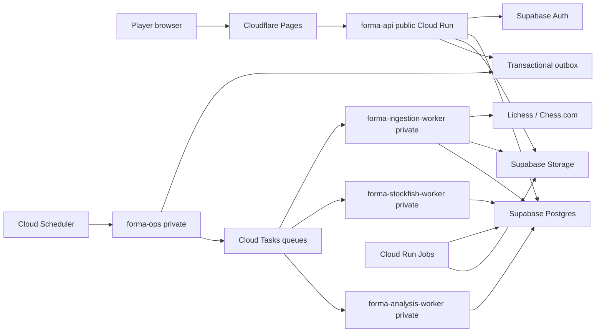

# Forma v1 platform specification

Status: canonical v1 contract  
Version: 1.0  
Date: 2026-08-15  
Companion documents: `database-architecture.md`, `v1-platform-audit.md`,
`v1-api-contract.md`, and `v1-delivery-plan.md`

## 1. Product outcome

Forma helps an improving online chess player understand what repeatedly happens
in their games, choose a concrete goal, practise the decisions that matter, and
verify that the learning transfers into later games.

V1 is successful when a player can:

1. create an account and link one or more Lichess/Chess.com identities;
2. import their completed standard-chess history safely;
3. receive a trustworthy immutable baseline examination;
4. see a simple live trajectory, strengths, weaknesses, connections, and
   uncertainty rather than a dump of engine numbers;
5. choose a measurable improvement goal and commitment;
6. receive evidence-backed practice and review work;
7. see whether later real-game decisions demonstrate improvement;
8. export or delete their data and understand what is retained.

Forma does not claim to measure innate intelligence. Its “Forma profile” is a
versioned multidimensional estimate of demonstrated chess decisions under named
conditions. It does not replace Lichess, Chess.com, or FIDE ratings.

## 2. V1 scope

### Included

- Supabase email/password and supported social authentication through Supabase;
- one personal analysis subject per Forma user;
- multiple explicitly linked Lichess and Chess.com accounts per subject;
- independent linking of the same public provider account by multiple users;
- completed standard games only;
- import and scheduled incremental synchronization;
- exact replay revisions, positions, occurrences, transitions, clocks, ratings,
  and provenance when supplied;
- objective Stockfish analysis with selective deeper analysis;
- deterministic structural features, events, motifs, and concept opportunities;
- rating-conditioned practical-context outputs when the promoted human model is
  calibrated for the segment, with a clear unavailable fallback otherwise;
- successes, mistakes, failures, recovery, defence, prevention, counterplay,
  and censored/untested opportunities;
- phase-aligned player trajectory and recovery measures;
- immutable onboarding baseline plus advancing live publications;
- optional short adaptive diagnostic during onboarding;
- goals, coaching cycles, commitments, assignments, attempts, review schedules,
  and real-game transfer evidence;
- opening explorer, repertoire choices, opening drills, mistake-derived practice,
  and guided lesson progress under the unified coaching model;
- public lookup by unique Forma handle; provider-handle lookup only by opt-in;
- curated public case studies with explicit editorial provenance;
- free/pro entitlements, Stripe checkout/portal/webhooks, usage accounting;
- private exports and complete account deletion workflow;
- Cloudflare Pages frontend, Google Cloud Run backend, Supabase Postgres/Auth/
  Storage, Cloud Tasks, Cloud Scheduler, and Cloud Run Jobs.

### Explicitly excluded

- Chess960 or any other variant, including storage of its replay/game ID;
- analysis of games still in progress;
- direct move advice for a game in progress;
- friendship, messaging, co-op learning, shared private reports, or clubs;
- native mobile applications;
- arbitrary browser access to analytical database tables;
- unconstrained semantic/embedding similarity as an authoritative v1 claim;
- unconstrained dynamic time warping for the homepage trajectory;
- Lc0/GPU inference as a required production dependency;
- LLM-generated chess judgments or evidence;
- Kubernetes, Kafka, Pub/Sub, Redis, BigQuery, or WebSockets;
- a promise that provider APIs or public data are always available;
- automatic merge of an epic without an independent review gate.

## 3. Locked product policies

### 3.1 Eligible storage and analysis

- Provider adapters reject unsupported variants before canonical persistence and
  increment only an aggregate rejection reason on the sync run.
- Empty, malformed, aborted-without-a-legal-move, or incomplete games are not
  canonical games. Aggregate rejection diagnostics may be retained.
- All valid completed standard games are retained while a subject/source owns
  them.
- `coverage_policy_v1` selects rated human-versus-human rapid, blitz, and
  classical games for the broad onboarding examination. Bullet,
  correspondence, casual, and bot games are separate evidence strata.
- A provisional 50 eligible games is the broad-report threshold. Coverage is
  also reported per skill, phase, speed, color, and recency. Fifty games does
  not manufacture confidence for rare concepts.
- Players outside the calibrated 1000–2200 provider-rating bands may still use
  Forma, but estimates visibly carry `outside_calibrated_range` and the product
  does not render false precision.

All numbers above are immutable policy-version content. Changing them produces
a new cohort/policy version and shadow comparison.

### 3.2 Comparison frames

Every player estimate names one of:

- `personal_current`: performance relative to the player's own prior evidence;
- `peer_current`: calibrated expectation around their provider/rating/speed;
- `peer_stretch`: a versioned next-standard target selected from the goal;
- `objective`: engine/legality optimum independent of human likelihood.

The v1 stretch policy defaults to the next calibrated rating band, approximately
100–200 rating points above the player's stable current pool, but never stores
`rating + constant` as a fact. Pool, provider, speed, reliability, sample size,
and target policy version are inputs.

### 3.3 Decision evidence

Each legal player move is a transition and therefore a potential decision. It
is not automatically an important observation. A versioned detector determines
whether the transition contains a concept opportunity, threat, choice, error,
successful execution, prevention, recovery, or other evidence.

- `successful`: the named opportunity occurred, the player selected a move that
  satisfied the rubric, and the relevant consequence was observed or proven by
  deterministic/engine analysis.
- `partially_successful`: only valid for a graded concept rubric whose named
  subcriteria were partly satisfied—for example, recognizing a threat but
  choosing a defence that loses less yet does not fully neutralize it.
- `unsuccessful`: the opportunity occurred and the decision failed the named
  rubric.
- `censored`: the skill-relevant outcome was not observable, for example because
  the opponent did not choose the testing continuation. Censored evidence does
  not become success or failure.

`untested` is a presentation description of absent/censored evidence, not a
decision outcome stored on a move.

### 3.4 Improvement and recovery

- Practice performance can update practice mastery and scheduling only.
- A chess-strength improvement claim requires a comparable later real-game
  opportunity.
- An early positive transfer can be shown as evidence before the system has
  enough observations to claim stable improvement.
- Stable improvement requires the versioned estimator's probability/confidence
  threshold and effective sample size.
- Recovery is measured after an adverse evaluation change using player-relative
  expected-score trajectories, opportunity quality, and eventual stabilization;
  it is not “the final result was good.”
- A player who blunders and creates sound counterplay/rebuilds expected score is
  distinguished from one who blunders and collapses. The original blunder
  remains a blunder.

### 3.5 Homepage trajectory

`trajectory_alignment_v1` aligns games through named landmarks:

1. normalized opening progress;
2. opening-to-middlegame transition;
3. normalized middlegame progress;
4. middlegame-to-endgame transition when present;
5. normalized endgame progress;
6. termination.

Games without an endgame contribute only to applicable bins. Every bin exposes
sample count, weighted mean/median expected score, uncertainty band, adverse
change, recovery slope, and survival/selection information. The display must
not imply that all games follow one exact curve.

## 4. System context

Postgres is the authoritative business/work ledger. Cloud Tasks is an
at-least-once delivery mechanism, not the source of workflow truth. Storage is
an artifact body store, not the ownership catalogue.

## 5. Environments and regions

- `local`: local Node/frontend, disposable local or dedicated development DB;
- `staging`: separate EU Supabase project and GCP project; production-shaped
  grants, queues, workers, Storage buckets, and synthetic/test subjects;
- `production`: separate EU Supabase and GCP projects; no test subjects or
  ad-hoc migrations.

Production and staging use `europe-west1` Cloud Run/Tasks/Scheduler unless the
chosen Supabase region makes another EU Cloud Run region materially closer.
Region choice is recorded once with measured DB round-trip latency.

No production secret is shared with staging. No runtime identity can administer
both environments.

## 6. Deployable services

### 6.1 `forma-api`

- public ingress; only service called by the browser;
- validates Supabase JWTs locally against cached JWKS where supported, including
  issuer, audience, expiry, and signing key rotation; Supabase `getUser` remains
  a controlled fallback for legacy tokens/revocation-sensitive operations;
- resolves actor, profile, subject, entitlement, and ownership;
- serves bounded reads and creates commands/workflows;
- never calls Stockfish or a large model;
- never performs provider archive import in request lifetime;
- returns within a 30-second platform timeout target; normal p95 target <500 ms
  excluding provider lookup and authorized artifact signing;
- initial concurrency 40, max instances set from the database connection budget.

### 6.2 `forma-ops`

- private ingress, invokable only by Scheduler/authorized service accounts;
- dispatches committed outbox events to Cloud Tasks;
- enqueues due account syncs;
- recovers expired leases and reconciles queue/work-ledger drift;
- runs retention/deletion/reconciliation sweeps;
- does no engine analysis.

### 6.3 `forma-ingestion-worker`

- private authenticated task endpoint;
- one account sync per task execution;
- distributed provider and account locks;
- serial provider traffic according to provider rules;
- normalizes outside transactions and commits checkpoints atomically;
- bounded task duration; resumes from durable checkpoint after termination;
- concurrency initially 1 per instance and limited provider-wide by queue.

### 6.4 `forma-stockfish-worker`

- private authenticated task endpoint;
- owns Stockfish processes and objective analysis only;
- concurrency 1 per instance for v1;
- CPU/memory sized by benchmark, initially at least 2 vCPU/2 GiB;
- max instances capped by DB and monthly compute budgets;
- writes immutable typed evaluation outputs and completes one work item;
- engine binary hash, NNUE hash, profile, limits, and worker revision required.

### 6.5 `forma-analysis-worker`

- private authenticated task endpoint;
- deterministic feature/event/concept detection;
- promoted human-policy inference when available;
- player estimation, trajectory, finding/report rendering, coaching/transfer, and
  atomic publication task types;
- logical handlers remain separate packages even though v1 deploys one service;
- concurrency configured per handler resource class; heavy model inference uses
  a separate queue and can later split without schema changes.

### 6.6 Cloud Run Jobs

Separate job entrypoints use immutable images for:

- database migration/verification;
- additive legacy backfill and reconciliation;
- opening/concept/model catalogue import;
- full or scoped rematerialization/reanalysis;
- export/research corpus generation;
- backup/restore and deletion drills.

Jobs checkpoint progress and are safe to resume. Ordinary user work never
starts a new Cloud Run Job.

## 7. Queues and scheduling

Initial queues:

| Queue | Target | Purpose | Initial dispatch rule |
| --- | --- | --- | --- |
| `provider-lichess` | ingestion | Lichess lookups/sync | one active request globally; 429 pauses >=60s |
| `provider-chesscom` | ingestion | Chess.com archive sync | serial/low parallelism with conditional requests |
| `stockfish-screen` | Stockfish | bounded screening | concurrency governed by worker max instances |
| `stockfish-deep` | Stockfish | selected MultiPV/deep work | lower rate, higher priority policy explicit |
| `analysis` | analysis | features, human model, estimates, reports | handler-specific resource limits |
| `maintenance` | ops/analysis | deletion, export, rebuild, reconciliation | low rate, independent retries |

Cloud Tasks payload contains `workItemId`, `attemptToken`, and trace metadata—no
PGN, FEN list, model output, email, provider credential, or authorization truth.
The worker authenticates the caller, atomically claims the row, loads immutable
inputs from Postgres/Storage, and verifies task kind matches its allowlist.

Schedules:

- outbox dispatch: every minute and also kicked opportunistically after commands;
- due sync enqueue: every 15 minutes; each account's policy determines due time;
- expired lease recovery: every 5 minutes;
- deletion/export/retention sweep: hourly;
- billing/provider reconciliation: daily;
- database/analysis health summaries: daily;
- backups and restore drills follow environment runbooks, not application cron.

## 8. Durable workflow contract

Workflow states: `queued`, `running`, `succeeded`, `failed`, `cancelling`,
`cancelled`. A terminal state never returns to a nonterminal state.

Work item states: `blocked`, `ready`, `leased`, `succeeded`, `retry_wait`,
`dead`, `cancelled`.

Rules:

- command and workflow are created in one short transaction with an outbox row;
- dependency completion moves eligible children from `blocked` to `ready`;
- claim is compare-and-set/row-lock based and creates an attempt record;
- every side effect has a stable idempotency key scoped to handler version;
- lease expiry does not imply side effects did not occur; retry rechecks output;
- retry classification distinguishes transient, rate-limit, invalid-input,
  unsupported, unauthorized, budget, and permanent model/engine failure;
- backoff and next-attempt time are durable;
- dead work surfaces a safe workflow error and operator diagnostic;
- cancellation stops future unleased work; a leased handler cooperatively checks
  cancellation between bounded units;
- progress is derived from item weights/states, not mutable counters alone;
- publication is a final atomic pointer switch after required outputs validate;
- queue delivery acknowledgement occurs only after the authoritative work-item
  transition commits.

## 9. Canonical ingestion transaction

A provider network response is fetched and normalized before the transaction.
For one provider checkpoint, the transaction:

1. locks the linked account/sync state in a consistent order;
2. verifies the expected prior cursor/checkpoint and active lease;
3. upserts provider identities and provider-game source metadata;
4. inserts a new immutable replay revision only if its normalized replay digest
   is new;
5. inserts participants, subject-game ownership/source relationships, rating
   observations, and source artifact references;
6. records rejection counts without retaining unsupported variant identifiers;
7. inserts downstream materialization work and outbox events idempotently;
8. records the checkpoint and advances provider cursor/validators;
9. commits all changes together.

If any database statement fails, the transaction rolls back and the same
checkpoint can be replayed. Object upload is not inside the transaction: the
artifact lifecycle reaches `ready` only after checksum verification, and the
transaction attaches that ready artifact. An orphan sweeper removes abandoned
pending uploads.

## 10. Data architecture

`plans/database-architecture.md` is normative for domain separation, table
responsibilities, ownership, immutability, version graphs, deletion, queries,
and indexes. This specification adds these physical rules:

- all new tables live in `app`, `social`, `chess`, `analysis`, `coaching`, or
  `ops`; internal schemas are not Data API exposed;
- `api` is empty unless a reviewed browser-facing function/view is explicitly
  needed; v1 product data goes through `forma-api`;
- separate `forma_api`, `forma_ops`, `forma_ingestion`, `forma_stockfish`,
  `forma_analysis`, and `forma_migrator` roles receive named grants only;
- `PUBLIC`, `anon`, and `authenticated` get no internal schema/table privileges;
- RLS is defense in depth and is forced/tested where runtime roles operate on
  tenant rows; shared catalogues/caches use explicit grants and API authorization;
- all FK columns have indexes; all high-volume list queries use keyset indexes;
- runtime services use Supabase transaction pooling on port 6543 with prepared
  statements disabled and explicit small client pools;
- migrations/backups use the direct/admin endpoint, never runtime credentials;
- aggregate connection budget includes every service maximum and Supabase
  internal headroom before Cloud Run max instances are set;
- exact DDL, comments, grants, policies, and named queries are reviewed together;
- migration history has one authority. Generated SQL is committed and reviewed;
- old tables remain additive/read-only until reconciliation and cutover pass.

### 10.1 Position identity

`core_position` captures board arrangement, side to move, castling rights, and
legally relevant en-passant state. It intentionally excludes halfmove/fullmove
counters and game history.

`position_occurrence` captures replay revision, ply, halfmove clock, fullmove
number, repetition/history context, clocks, subject/player role, phase, and
neighbor transitions. Exact legal-rule claims use occurrence context, not the
core position alone.

`game_transition` connects occurrence N to N+1 and stores the played move facts.
All semantic judgments are separate immutable outputs tied to method versions.

### 10.2 Replay shape

The immutable replay revision stores a compact versioned JSON document for
authoritative replay plus relational metadata and participants. Searchable
positions/transitions are relational materializations. This avoids a mutable
row per move as authority without sacrificing positional queries.

## 11. Artifact storage

V1 uses Supabase Storage behind an `ArtifactStore` interface.

Private buckets:

- `subject-artifacts`: raw provider bodies when retention is justified,
  normalized PGN/replay exports, large game analysis artifacts, baseline/report
  render artifacts; strict subject deletion;
- `system-artifacts`: immutable model weights, catalogues, method assets, and
  licensed editorial inputs, named by checksum/version;
- `exports`: generated user exports with short expiry and deletion sweep.

Static web assets remain on Cloudflare Pages. There is no general public bucket.

Postgres artifact records contain backend, bucket, opaque key, content type,
byte size, SHA-256, state, ownership/retention class, creator/run, timestamps,
and deletion status. Object keys contain UUIDs/checksums, never email or handles.

Lifecycle: `pending -> ready -> deleting -> deleted`, with `failed` for a
terminal verified failure. API downloads authorize against Postgres and return a
short-lived signed URL. Clients never supply a bucket/key. Server S3 credentials
bypass RLS and therefore live only in Secret Manager; only services that need
object access receive them.

Because Supabase Storage does not provide S3 object versioning, system artifacts
are immutable/checksummed and backed by their source/recovery policy. User
deletion is deliberately permanent.

## 12. Analysis architecture

### 12.1 Model roles

- deterministic chess code: legality, attacks, material, pawn structure,
  forcing moves, threats, motifs, and auditable feature changes;
- Stockfish: objective evaluation, WDL, mate, adequate candidates, MultiPV,
  refutations, only-move pressure;
- promoted human policy model: rating-conditioned move likelihood and human
  outcome likelihood, never objective truth;
- optional Lc0 research: selected disagreement/strategic review only after an
  explicit benchmark and deployment decision;
- language model: render already-supported structured evidence into prose;
  never invent scores, motifs, causes, or recommendations.

AlphaZero is not a deployable option because no production weights/system are
available. Maia-family weights require licence review and Forma holdout
calibration before promotion. A model unavailable for a segment yields
`practical_context_status: unavailable`, not a Stockfish-derived substitute.

### 12.2 Practical counterplay

For position `p`, Stockfish produces the adequate move set `A` under a versioned
objective tolerance. The calibrated human policy produces move probabilities
conditioned on available rating/provider/speed context. Forma stores:

- probability mass on `A`;
- adequate-set size and policy entropy;
- best-refutation probability and rank;
- forcingness/only-move evidence;
- model segment and calibration version;
- objective expected-score change;
- human expected-score change when supplied;
- uncertainty and out-of-domain flags.

Practical pressure is a vector and evidence, not one universal “practicality
score.” An opponent's later failure is separate evidence and does not make an
objectively bad move brilliant retroactively.

### 12.3 Versioning and promotion

Every component has immutable code/config/data/model hashes and dependencies.
Recipes pin component versions. Candidate versions run in shadow on frozen
snapshots and are compared for:

- correctness fixtures;
- coverage/failure rate;
- calibration and subgroup calibration;
- stability and changed conclusions;
- latency, storage, and compute cost;
- explanation traceability;
- deletion/rebuild compatibility.

Promotion changes a pointer; it never overwrites old results. Rollback restores
the prior pointer.

## 13. Statistical contract

`estimator_v1` is transparent and interpretable:

- each atomic opportunity supplies a rubric score, weight, censoring state,
  cohort context, and timestamp;
- time weighting uses a versioned exponential half-life policy initially;
- evidence is stratified by provider/speed/rating band/color/phase before any
  combination;
- a discounted Beta/Binomial-style estimator is used for bounded opportunity
  success dimensions where appropriate;
- continuous measures such as expected-score loss/recovery use robust weighted
  summaries and bootstrap/analytical intervals defined by estimator version;
- outputs include estimate, interval, effective sample size, raw sample size,
  coverage flags, prior/pooling inputs, and generated time;
- no green/red claim is shown solely because a player's move matches their own
  current-rating model;
- the dashboard distinguishes “good for current level,” “meeting stretch
  standard,” and “objectively strong”;
- subgroup and time-control estimates are not collapsed when heterogeneity is
  material;
- multiple findings are controlled by a versioned ranking/false-discovery or
  evidence-strength policy rather than publishing every noisy fluctuation.

Baseline evaluation and future experiments use frozen holdout cohorts. Product
telemetry may improve ranking/UI, but it does not silently redefine historical
chess evidence. New calculation methods are promoted through versioned shadow
comparison.

## 14. Onboarding and goal journey

1. Auth creates private profile and personal subject idempotently.
2. User selects a provider account; lookup confirms the public identity.
3. Link records confirmation/verification state without claiming ownership that
   was not proven.
4. Initial sync imports all available supported completed games within provider
   and entitlement constraints; UI shows durable progress.
5. Coverage report explains eligible game count and weak dimensions. With fewer
   than 50 broad eligible games, the user sees a useful limited report and the
   exact missing evidence—not a failure screen.
6. Analysis produces an immutable subject snapshot and preliminary findings.
7. Optional adaptive diagnostic presents a short bounded set of positions chosen
   to reduce uncertainty or test a suspected concept. Attempts are immutable.
8. Baseline publication combines game evidence and diagnostic evidence while
   keeping their source types distinct.
9. Report presents headline trajectory, strengths, constraints, recurring
   patterns, representative connections, and next opportunities.
10. Entitlements may hide detail/actions but not alter facts.
11. User selects a goal template or a bounded custom goal. Forma resolves it to
    metric targets, target comparison frame, evidence requirements, duration,
    and recommended commitment.
12. User accepts/edits commitments such as games and review/practice frequency.
13. Activation completes only after baseline, goal, and commitment exist.

## 15. Ongoing learning journey

1. Scheduler finds due linked accounts and creates sync workflows.
2. New replay revisions materialize into positions/transitions.
3. Analysis reuses exact compatible engine outputs and computes new outputs.
4. Aggregator creates a frozen subject snapshot and draft live publication.
5. Validation ensures all required components are compatible and evidence links
   resolve.
6. One transaction publishes the new dashboard/finding/trajectory pointers.
7. Transfer matcher compares new opportunities to prior interventions/practice.
8. Coaching plan and goal progress update from published evidence.
9. Notifications, if added, reference the published version and are out of the
   critical publication transaction.

The immutable onboarding baseline never moves. Live views may compare against
it and against later fixed checkpoints.

## 16. API boundary

All product endpoints are under `/v1`; health is `/health`. The full normative
contract is `plans/v1-api-contract.md`.

Global rules:

- JSON request/response with ISO-8601 UTC timestamps;
- Supabase bearer JWT for protected routes;
- `application/problem+json` errors with stable code and request ID;
- opaque keyset cursors;
- `Idempotency-Key` required for workflow-producing and payment commands;
- asynchronous work returns `202 Accepted` with a workflow resource;
- immutable resources use stable IDs and ETags where useful;
- responses identify publication/run/policy/model versions relevant to claims;
- clients never submit `userId`, storage key, engine binary path, model profile,
  arbitrary SQL filters, or worker task kind;
- no endpoint mirrors raw internal tables or returns opaque raw model payloads;
- OpenAPI 3.1 is generated/validated in CI and compatibility-tested against the
  frontend client.

## 17. Security contract

- browser owns only Supabase public URL/publishable key and user session;
- all product data access is authorized by API actor -> subject/access checks;
- internal schemas are not exposed to `anon` or `authenticated`;
- workers have private ingress and validate Google-signed OIDC audience/service
  account;
- one service account and one least-privilege DB role per deployment;
- secrets come from Secret Manager references, never image/build args or source;
- production DB password and Storage server credentials are rotated on incident
  and on documented cadence;
- expensive/public endpoints use distributed rate limits and abuse controls;
- Stripe webhooks verify raw-body signatures and deduplicate event IDs;
- return URLs and browser origins are environment allowlists;
- operator commands require explicit operator capability, not ordinary auth;
- logs redact tokens, secrets, email, PGN, FEN lists, prompts, provider bodies,
  signed URLs, and raw model output;
- security tests cover anonymous, cross-user, cross-subject, forged IDs, stale
  signed URLs, duplicate provider links, and worker caller spoofing;
- dependency/container scanning and secret scanning gate release.

## 18. Deletion, export, and retention

Account unlink removes the membership/source relationship and stops sync. It
does not delete a shared canonical replay while another subject/editorial source
owns it. When the last permitted source disappears, identifiable replay,
occurrences, analysis, and subject artifacts are deleted by the dependency
graph. Anonymous core-position/engine cache entries may remain only without a
user/game/source link.

Account deletion:

1. freezes new commands and marks deletion requested;
2. revokes sessions/links and cancels future work;
3. enumerates the versioned dependency manifest;
4. deletes private Storage objects with retry/confirmation;
5. removes subject-owned database data and last-reference shared data;
6. deletes profile/auth identity in the defined order;
7. records a content-free audit receipt and completion timestamp.

Deletion does not report success while an object deletion is unconfirmed.

Export is an asynchronous snapshot with manifest/checksums, human-readable PGN
and JSON/CSV where applicable, short-lived signed download, and automatic expiry.
V1 retention durations are configuration/policy-version values and are listed in
the operator runbook before production launch.

## 19. Observability and SLOs

Every request/workflow/work item/attempt/run/publication carries trace IDs.
Structured logs and metrics answer:

- can users authenticate and load current publications?;
- are provider syncs delayed/rate-limited?;
- what is queue depth and oldest ready-item age by class?;
- what failed permanently and for whom (opaque IDs only)?;
- are leases expiring or duplicate deliveries increasing?;
- what are Stockfish latency, nodes, cache hit, and cost per game?;
- are DB connections, CPU, memory, storage, or budgets near limits?;
- did a deployment change analysis outputs or error rates?;
- are deletion/export workflows meeting their deadlines?

Initial service objectives, finalized from staging measurements before launch:

- API availability 99.9% monthly excluding declared provider degradation;
- cached/bounded read p95 <500 ms and p99 <1.5 s;
- command acknowledgement p95 <750 ms;
- no lost committed workflow and idempotent duplicate delivery;
- 95% of ordinary new-game sync/analysis publications within 15 minutes when
  providers and queues are healthy;
- baseline examination ETA is measured and shown rather than promised as a
  fixed duration;
- deletion completes within the published policy deadline, with alerts well
  before breach.

Alerts have owner, threshold, burn window, and runbook link. Budget alerts exist
for GCP, Supabase compute/storage/egress, and model costs.

## 20. CI/CD and migration contract

Pull requests must pass:

- formatting/lint (when configured), typecheck, unit tests, and builds;
- deterministic ingestion/chess/engine/statistics fixtures;
- disposable Postgres migration from empty state;
- migration from a production-shaped legacy snapshot;
- schema drift, grants, RLS, anonymous/cross-user authorization tests;
- API OpenAPI/consumer contract tests;
- workflow duplicate/retry/termination tests;
- container build, vulnerability scan, licence inventory, and secret scan;
- production-shaped query benchmarks for changed named queries;
- analysis golden-corpus comparison for method changes.

Merge to `main` builds immutable images once. Staging deploys by digest, runs
smoke/integration/migration/reconciliation checks, and records evidence. The same
digest is promoted to production with environment config only. Database changes
use expand -> backfill -> verify -> switch pointer/read -> contract. Rollback is
a prior image/pointer or forward migration; destructive rollback is forbidden.

## 21. V1 readiness gates

V1 may launch only when:

1. live anonymous data exposure is closed and independently retested;
2. secrets are rotated and Secret Manager/service identities are in place;
3. target schema, grants, policies, and migration/reconciliation pass;
4. API contains no engine/provider import work in request process;
5. queue/worker duplicate, retry, cancellation, and termination tests pass;
6. one complete Lichess and one Chess.com subject journey pass end to end;
7. baseline, goal, practice, and later transfer journey passes with immutable
   evidence links;
8. out-of-range, insufficient-data, unknown-clock/rating, and provider-outage
   experiences are truthful;
9. model/statistical calibration and shadow-promotion evidence is recorded;
10. export, unlink, account deletion, restore, and failed-object-delete drills
    pass;
11. load tests prove service/DB connection budgets and Stockfish isolation;
12. observability, alerts, budgets, and operator runbooks are exercised;
13. legal/licence review covers provider data, Stockfish, human-model weights,
    opening/catalogue assets, public case studies, and generated explanations;
14. every Linear epic has passed its independent review gate and integration
    acceptance on `main`.

## 22. Change control

No specification can prevent every implementation discovery. V1 prevents
surprise-driven redesign by classifying changes:

- implementation detail within a locked contract: ticket/PR update only;
- method/policy improvement: new immutable version plus shadow comparison;
- additive API field: backward-compatible contract change;
- breaking API/schema/ownership/security change: architecture decision record,
  updated traceability, migration plan, and explicit approval before code;
- new infrastructure family or production model: benchmark/cost/security ADR
  and separate project decision.

An agent stops and escalates when acceptance requires changing a locked
invariant, deleting unreconciled data, weakening authorization, inventing an
unversioned method, or expanding scope beyond the epic.
